<!-- TOC -->

- [实验要求](#实验要求)
- [实验环境](#实验环境)
- [实验过程](#实验过程)
    - [TiUP 部署](#tiup-部署)
    - [sysbench 测试](#sysbench-测试)
        - [环境安装](#环境安装)
        - [测试准备](#测试准备)
        - [场景测试](#场景测试)
        - [监控截图](#监控截图)
    - [go-ycsb 测试](#go-ycsb-测试)
        - [环境安装](#环境安装-1)
        - [测试准备](#测试准备-1)
        - [场景测试](#场景测试-1)
        - [监控截图](#监控截图-1)
    - [go-tpc 测试](#go-tpc-测试)
        - [环境安装](#环境安装-2)
        - [TPCC 性能测试](#tpcc-性能测试)
        - [TPCH 性能测试](#tpch-性能测试)
        - [监控截图](#监控截图-2)
    - [实验分析](#实验分析)
- [实验资料](#实验资料)

<!-- /TOC -->
## 实验要求
使用 sysbench、go-ycsb 和 go-tpc 分别对 TiDB 进行测试并且产出测试报告。

测试报告需要包括以下内容：

* 部署环境的机器配置(CPU、内存、磁盘规格型号)，拓扑结构(TiDB、TiKV 各部署于哪些节点)
* 调整过后的 TiDB 和 TiKV 配置
* 测试输出结果
* 关键指标的监控截图
  * TiDB Query Summary 中的 qps 与 duration
  * TiKV Details 面板中 Cluster 中各 server 的 CPU 以及 QPS 指标
  * TiKV Details 面板中 grpc 的 qps 以及 duration

输出：写出你对该配置与拓扑环境和 workload 下 TiDB 集群负载的分析，提出你认为的 TiDB 的性能的瓶颈所在(能提出大致在哪个模块即可)

## 实验环境
| 组件 | IP 地址 | 操作系统 | CPU | 内存 | 磁盘规格型号 | 网卡 | 
|  ----  | ----  |  ----  | ----  |  ----  | ----  |  ----  |
| TiDB | 192.168.130.31  |  CentOS 7.7  | 12  Intel(R) Core(TM) i7-8700 CPU @ 3.20GHz  |  16G  | HDD  | 千兆网卡 | 
| TiKV1 | 192.168.130.33  |  CentOS 7.8  | 12  Intel(R) Core(TM) i7-8700 CPU @ 3.20GHz  |  16G  | HDD  | 千兆网卡 | 
| TiKV2 | 192.168.130.34  |  CentOS 7.7  | 12  Intel(R) Core(TM) i7-8700 CPU @ 3.20GHz  |  16G  | HDD  | 千兆网卡 | 
| TiKV3 | 192.168.130.35  |  CentOS 7.5  | 12  Intel(R) Core(TM) i7-8700 CPU @ 3.20GHz  |  16G  | HDD  | 千兆网卡 | 
| PD1 | 192.168.130.33  |  CentOS 7.8  | 12  Intel(R) Core(TM) i7-8700 CPU @ 3.20GHz  |  16G  | HDD  | 千兆网卡 | 
| PD2 | 192.168.130.34  |  CentOS 7.7  | 12  Intel(R) Core(TM) i7-8700 CPU @ 3.20GHz  |  16G  | HDD  | 千兆网卡 | 
| PD3 | 192.168.130.35  |  CentOS 7.5  | 12  Intel(R) Core(TM) i7-8700 CPU @ 3.20GHz  |  16G  | HDD  | 千兆网卡 |

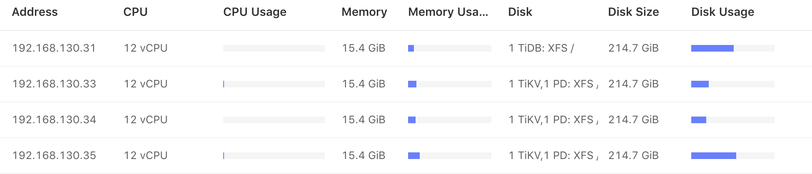

## 实验过程
### TiUP 部署
1. 执行如下命令安装 TiUP 工具：
```
curl --proto '=https' --tlsv1.2 -sSf https://tiup-mirrors.pingcap.com/install.sh | sh
```
2. 按如下步骤设置 TiUP 环境变量：

重新声明全局环境变量：
```
source ~/.zshrc
```
确认 TiUP 工具是否安装：
```
which tiup
```
3. 安装 TiUP cluster 组件：
```
tiup cluster
```
4. 如果已经安装，则更新 TiUP cluster 组件至最新版本：
```
tiup update --self && tiup update cluster
```
预期输出 `Update successfully!` 字样。

5. 验证当前 TiUP cluster 版本信息。执行如下命令查看 TiUP cluster 组件版本：
```
tiup --binary cluster
```
6. 根据不同的集群拓扑，编辑 TiUP 所需的集群初始化配置 yaml 文件，我选择了最简单的拓扑结构：1 TiDB + 3 TiKV + 3 PD。此外也根据此部署场景调整了一些参数来进行优化。
```
# # Global variables are applied to all deployments and used as the default value of
# # the deployments if a specific deployment value is missing.
global:
  user: "liurui"
  ssh_port: 22
  deploy_dir: "txy_test/deploy"
  data_dir: "txy_test/data"

server_configs:
  tidb:
    binlog.enable: false
    binlog.ignore-error: false
  tikv:
    # 通常情况下使用默认值就可以了。在导数据的情况下建议将该参数设置为 1024000
    storage.scheduler-concurrency: 1024000
    # 该参数控制写入线程的个数，当写入操作比较频繁的时候，需要把该参数调大。使用 top -H -p tikv-pid
    # 发现名称为 sched-worker-pool 的线程都特别忙，这个时候就需要将 scheduler-worker-pool-size
    # 参数调大，增加写线程的个数。
    storage.scheduler-worker-pool-size: 8
    # 默认为 true，表示强制将数据刷到磁盘上。如果是非金融安全级别的业务场景，建议设置成 false，
    # 以便获得更高的性能。
    raftstore.sync-log: false
    # 开启 RocksDB compaction 过程中的预读功能，如果使用的是机械磁盘，建议该值至少为2MB。
    rocksdb.compaction-readahead-size: "2MB"
    # 最多允许几个 memtable 存在。写入到 RocksDB 的数据首先会记录到 WAL 日志里面，然后会插入到
    # memtable 里面，当 memtable 的大小到达了 write-buffer-size 限定的大小的时候，当前的
    # memtable 会变成只读的，然后生成一个新的 memtable 接收新的写入。只读的 memtable 会被
    # RocksDB 的 flush 线程（max-background-flushes 参数能够控制 flush 线程的最大个数）
    # flush 到磁盘，成为 level0 的一个 sst 文件。当 flush 线程忙不过来，导致等待 flush 到磁盘的
    # memtable 的数量到达 max-write-buffer-number 限定的个数的时候，RocksDB 会将新的写入
    # stall 住，stall 是 RocksDB 的一种流控机制。在导数据的时候可以将 max-write-buffer-number
    # 的值设置的更大一点，例如 10。
    rocksdb.defaultcf.max-write-buffer-number: 10
    # 当 level0 的 sst 文件个数到达 level0-slowdown-writes-trigger 指定的限度的时候，
    # RocksDB 会尝试减慢写入的速度。因为 level0 的 sst 太多会导致 RocksDB 的读放大上升。
    # level0-slowdown-writes-trigger 和 level0-stop-writes-trigger 是 RocksDB 进行流控的
    # 另一个表现。当 level0 的 sst 的文件个数到达 4（默认值），level0 的 sst 文件会和 level1 中
    # 有 overlap 的 sst 文件进行 compaction，缓解读放大的问题。
    rocksdb.defaultcf.level0-slowdown-writes-trigger: 20
    readpool.storage.use-unified-pool: false
    readpool.coprocessor.use-unified-pool: true
  pd:
    schedule.leader-schedule-limit: 4
    schedule.region-schedule-limit: 2048
    schedule.replica-schedule-limit: 64
  

pd_servers:
  - host: 192.168.130.33
  - host: 192.168.130.34
  - host: 192.168.130.35

tidb_servers:
  - host: 192.168.130.31

tikv_servers:
  - host: 192.168.130.33
  - host: 192.168.130.34
  - host: 192.168.130.35

monitoring_servers:
  - host: 192.168.130.31

grafana_servers:
  - host: 192.168.130.31

alertmanager_servers:
  - host: 192.168.130.31

```
7. 登陆所有部署服务器后执行以下命令，将 `liurui ALL=(ALL) NOPASSWD: ALL` 添加到文件末尾，即对 liurui 用户配置好部署机器的 sudo 免密码。
```
sudo vim visudo
```
8. 执行部署命令：
```
tiup cluster deploy tidb-test v4.0.0 ./topology.yaml --user liurui
```
预期日志结尾输出会有 `Deployed cluster "tidb-test" successfully` 关键词，表示部署成功。

9. 查看 TiUP 管理的集群情况：
```
tiup cluster list
```
TiUP 支持管理多个 TiDB 集群，该命令会输出当前通过 TiUP cluster 管理的所有集群信息，包括集群名称、部署用户、版本、密钥信息等。

10. 检查部署的 TiDB 集群情况
例如，执行如下命令检查 tidb-test 集群情况：
```
tiup cluster display tidb-test
```
预期输出包括 tidb-test 集群中实例 ID、角色、主机、监听端口和状态（由于还未启动，所以状态为 Down/inactive）、目录信息。

11. 启动集群：
```
tiup cluster start tidb-test
```
预期结果输出 `Started cluster "tidb-test" successfully` 标志启动成功。

12. 验证集群运行状态：
```
tiup cluster display tidb-test
```
预期结果输出，注意 Status 状态信息为 Up 说明集群状态正常

13. 执行如下命令登录数据库：
```
mysql -u root -h 192.168.130.31 -P 4000
```

14. 查看 [TiDB Dashboard](http://192.168.130.33:2379/dashboard)。

15. 查看 [TiDB Granafa](http://192.168.130.31:3000/)。

### sysbench 测试
#### 环境安装
参照 [sysbench](https://github.com/akopytov/sysbench) 的文档的安装方法，macOS 执行如下命令即可：
```
brew install sysbench

sysbench --version
# sysbench 1.0.19
```
#### 测试准备
* 编辑配置文件：
```
mysql-host=192.168.130.31
mysql-port=4000
mysql-user=root
mysql-db=sysbench
time=600
threads=32
report-interval=10
db-driver=mysql
```
* 创建数据库：
```
create database sysbench;
```
* 导入数据之前先设置为乐观事务模式，导入结束后再设置回悲观模式：
```
set global tidb_disable_txn_auto_retry=off;
set global tidb_txn_mode="optimistic";
```
* 导入数据：
```
sysbench oltp_point_select --config-file=config --tables=32 --table-size=100000 prepare
```
* 调整回悲观事务：
```
set global tidb_txn_mode="pessimistic";
```

#### 场景测试
* Point select 场景测试：
```
> sysbench oltp_point_select --config-file=config --threads=32 --tables=32 --table-size=100000 run
sysbench 1.0.19 (using bundled LuaJIT 2.1.0-beta2)

Running the test with following options:
Number of threads: 32
Report intermediate results every 10 second(s)
Initializing random number generator from current time


Initializing worker threads...

Threads started!

[ 10s ] thds: 32 tps: 803.91 qps: 803.91 (r/w/o: 803.91/0.00/0.00) lat (ms,95%): 43.39 err/s: 0.00 reconn/s: 0.00
[ 20s ] thds: 32 tps: 802.49 qps: 802.49 (r/w/o: 802.49/0.00/0.00) lat (ms,95%): 43.39 err/s: 0.00 reconn/s: 0.00
[ 30s ] thds: 32 tps: 823.47 qps: 823.47 (r/w/o: 823.47/0.00/0.00) lat (ms,95%): 41.85 err/s: 0.00 reconn/s: 0.00
...
[ 580s ] thds: 32 tps: 821.45 qps: 821.45 (r/w/o: 821.45/0.00/0.00) lat (ms,95%): 41.85 err/s: 0.00 reconn/s: 0.00
[ 590s ] thds: 32 tps: 823.22 qps: 823.22 (r/w/o: 823.22/0.00/0.00) lat (ms,95%): 41.10 err/s: 0.00 reconn/s: 0.00
[ 600s ] thds: 32 tps: 803.40 qps: 803.40 (r/w/o: 803.40/0.00/0.00) lat (ms,95%): 41.85 err/s: 0.00 reconn/s: 0.00
SQL statistics:
    queries performed:
        read:                            488904
        write:                           0
        other:                           0
        total:                           488904
    transactions:                        488904 (814.79 per sec.)
    queries:                             488904 (814.79 per sec.)
    ignored errors:                      0      (0.00 per sec.)
    reconnects:                          0      (0.00 per sec.)

General statistics:
    total time:                          600.0339s
    total number of events:              488904

Latency (ms):
         min:                                   35.68
         avg:                                   39.27
         max:                                  354.06
         95th percentile:                       42.61
         sum:                             19199176.95

Threads fairness:
    events (avg/stddev):           15278.2500/6.99
    execution time (avg/stddev):   599.9743/0.01
```
* Update index 场景测试：
```
> sysbench oltp_update_index --config-file=config --threads=32 --tables=32 --table-size=100000 run
sysbench 1.0.19 (using bundled LuaJIT 2.1.0-beta2)

Running the test with following options:
Number of threads: 32
Report intermediate results every 10 second(s)
Initializing random number generator from current time


Initializing worker threads...

Threads started!

[ 10s ] thds: 32 tps: 709.69 qps: 709.69 (r/w/o: 0.00/708.19/1.50) lat (ms,95%): 48.34 err/s: 0.00 reconn/s: 0.00
[ 20s ] thds: 32 tps: 707.08 qps: 707.08 (r/w/o: 0.00/705.38/1.70) lat (ms,95%): 51.02 err/s: 0.00 reconn/s: 0.00
[ 30s ] thds: 32 tps: 714.30 qps: 714.30 (r/w/o: 0.00/713.80/0.50) lat (ms,95%): 49.21 err/s: 0.00 reconn/s: 0.00
...
[ 580s ] thds: 32 tps: 716.26 qps: 716.26 (r/w/o: 0.00/715.36/0.90) lat (ms,95%): 49.21 err/s: 0.00 reconn/s: 0.00
[ 590s ] thds: 32 tps: 722.38 qps: 722.38 (r/w/o: 0.00/721.38/1.00) lat (ms,95%): 48.34 err/s: 0.00 reconn/s: 0.00
[ 600s ] thds: 32 tps: 713.36 qps: 713.36 (r/w/o: 0.00/712.16/1.20) lat (ms,95%): 48.34 err/s: 0.00 reconn/s: 0.00
SQL statistics:
    queries performed:
        read:                            0
        write:                           428782
        other:                           576
        total:                           429358
    transactions:                        429358 (715.47 per sec.)
    queries:                             429358 (715.47 per sec.)
    ignored errors:                      0      (0.00 per sec.)
    reconnects:                          0      (0.00 per sec.)

General statistics:
    total time:                          600.1075s
    total number of events:              429358

Latency (ms):
         min:                                   36.68
         avg:                                   44.72
         max:                                  432.94
         95th percentile:                       48.34
         sum:                             19199645.62

Threads fairness:
    events (avg/stddev):           13417.4375/8.49
    execution time (avg/stddev):   599.9889/0.02
```
* Read only 场景测试：
```
> sysbench oltp_read_only --config-file=config --threads=32 --tables=32 --table-size=100000 run
sysbench 1.0.19 (using bundled LuaJIT 2.1.0-beta2)

Running the test with following options:
Number of threads: 32
Report intermediate results every 10 second(s)
Initializing random number generator from current time


Initializing worker threads...

Threads started!

[ 10s ] thds: 32 tps: 44.78 qps: 742.73 (r/w/o: 649.96/0.00/92.77) lat (ms,95%): 733.00 err/s: 0.00 reconn/s: 0.00
[ 20s ] thds: 32 tps: 47.99 qps: 755.03 (r/w/o: 659.05/0.00/95.98) lat (ms,95%): 694.45 err/s: 0.00 reconn/s: 0.00
[ 30s ] thds: 32 tps: 45.11 qps: 749.64 (r/w/o: 659.61/0.00/90.03) lat (ms,95%): 707.07 err/s: 0.00 reconn/s: 0.00
...
[ 580s ] thds: 32 tps: 48.32 qps: 767.57 (r/w/o: 670.93/0.00/96.63) lat (ms,95%): 694.45 err/s: 0.00 reconn/s: 0.00
[ 590s ] thds: 32 tps: 48.20 qps: 770.00 (r/w/o: 673.70/0.00/96.30) lat (ms,95%): 694.45 err/s: 0.00 reconn/s: 0.00
[ 600s ] thds: 32 tps: 21.90 qps: 353.14 (r/w/o: 309.44/0.00/43.71) lat (ms,95%): 5124.81 err/s: 0.00 reconn/s: 0.00
SQL statistics:
    queries performed:
        read:                            398846
        write:                           0
        other:                           56978
        total:                           455824
    transactions:                        28489  (46.78 per sec.)
    queries:                             455824 (748.53 per sec.)
    ignored errors:                      0      (0.00 per sec.)
    reconnects:                          0      (0.00 per sec.)

General statistics:
    total time:                          608.9606s
    total number of events:              28489

Latency (ms):
         min:                                  621.51
         avg:                                  678.81
         max:                                15131.96
         95th percentile:                      707.07
         sum:                             19338591.04

Threads fairness:
    events (avg/stddev):           890.2812/1.12
    execution time (avg/stddev):   604.3310/2.34
```

* Write only 场景测试：
```
> sysbench oltp_write_only --config-file=config --threads=32 --tables=32 --table-size=100000 run
sysbench 1.0.19 (using bundled LuaJIT 2.1.0-beta2)

Running the test with following options:
Number of threads: 32
Report intermediate results every 10 second(s)
Initializing random number generator from current time


Initializing worker threads...

Threads started!

[ 10s ] thds: 32 tps: 124.81 qps: 758.15 (r/w/o: 0.00/505.03/253.12) lat (ms,95%): 277.21 err/s: 0.00 reconn/s: 0.00
[ 20s ] thds: 32 tps: 131.14 qps: 785.74 (r/w/o: 0.00/522.76/262.98) lat (ms,95%): 257.95 err/s: 0.00 reconn/s: 0.00
[ 30s ] thds: 32 tps: 111.89 qps: 670.76 (r/w/o: 0.00/447.57/223.19) lat (ms,95%): 325.98 err/s: 0.00 reconn/s: 0.00
...
[ 580s ] thds: 32 tps: 126.96 qps: 762.44 (r/w/o: 0.00/508.23/254.21) lat (ms,95%): 320.17 err/s: 0.00 reconn/s: 0.00
[ 590s ] thds: 32 tps: 128.77 qps: 773.04 (r/w/o: 0.00/515.49/257.55) lat (ms,95%): 257.95 err/s: 0.00 reconn/s: 0.00
[ 600s ] thds: 32 tps: 127.87 qps: 764.42 (r/w/o: 0.00/508.68/255.74) lat (ms,95%): 320.17 err/s: 0.00 reconn/s: 0.00
SQL statistics:
    queries performed:
        read:                            0
        write:                           275994
        other:                           138354
        total:                           414348
    transactions:                        69058  (115.03 per sec.)
    queries:                             414348 (690.17 per sec.)
    ignored errors:                      0      (0.00 per sec.)
    reconnects:                          0      (0.00 per sec.)

General statistics:
    total time:                          600.3541s
    total number of events:              69058

Latency (ms):
         min:                                  225.54
         avg:                                  278.13
         max:                                 8487.12
         95th percentile:                      331.91
         sum:                             19207055.10

Threads fairness:
    events (avg/stddev):           2158.0625/6.75
    execution time (avg/stddev):   600.2205/0.11
```

* Read Write 场景测试：
```
> sysbench oltp_read_write --config-file=config --threads=32 --tables=32 --table-size=100000 run
sysbench 1.0.19 (using bundled LuaJIT 2.1.0-beta2)

Running the test with following options:
Number of threads: 32
Report intermediate results every 10 second(s)
Initializing random number generator from current time


Initializing worker threads...

Threads started!

[ 10s ] thds: 32 tps: 34.78 qps: 724.01 (r/w/o: 512.15/139.01/72.85) lat (ms,95%): 1069.86 err/s: 0.00 reconn/s: 0.00
[ 20s ] thds: 32 tps: 37.00 qps: 742.01 (r/w/o: 517.00/151.10/73.90) lat (ms,95%): 977.74 err/s: 0.00 reconn/s: 0.00
[ 30s ] thds: 32 tps: 36.00 qps: 723.15 (r/w/o: 508.57/142.49/72.10) lat (ms,95%): 995.51 err/s: 0.00 reconn/s: 0.00
...
[ 580s ] thds: 32 tps: 38.49 qps: 769.19 (r/w/o: 538.43/153.68/77.09) lat (ms,95%): 861.95 err/s: 0.00 reconn/s: 0.00
[ 590s ] thds: 32 tps: 38.49 qps: 770.54 (r/w/o: 539.59/153.77/77.18) lat (ms,95%): 861.95 err/s: 0.00 reconn/s: 0.00
[ 600s ] thds: 32 tps: 38.40 qps: 764.87 (r/w/o: 534.18/153.79/76.90) lat (ms,95%): 877.61 err/s: 0.00 reconn/s: 0.00
SQL statistics:
    queries performed:
        read:                            315476
        write:                           90064
        other:                           45140
        total:                           450680
    transactions:                        22534  (37.48 per sec.)
    queries:                             450680 (749.55 per sec.)
    ignored errors:                      0      (0.00 per sec.)
    reconnects:                          0      (0.00 per sec.)

General statistics:
    total time:                          601.2648s
    total number of events:              22534

Latency (ms):
         min:                                  776.66
         avg:                                  852.94
         max:                                 2096.53
         95th percentile:                      943.16
         sum:                             19220241.92

Threads fairness:
    events (avg/stddev):           704.1875/1.70
    execution time (avg/stddev):   600.6326/0.34
```
#### 监控截图
* TiDB Query Summary 中的 qps 与 duration：
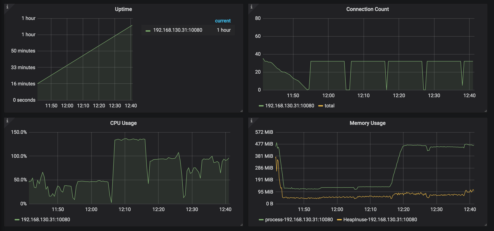
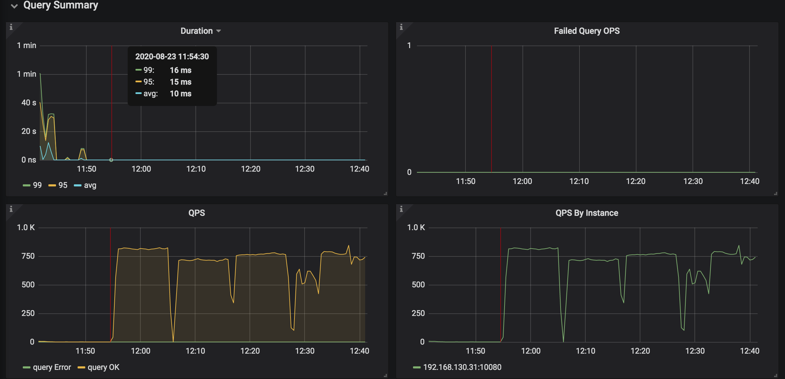

* TiKV Details 面板中 Cluster 中各 server 的 CPU 以及 QPS 指标：
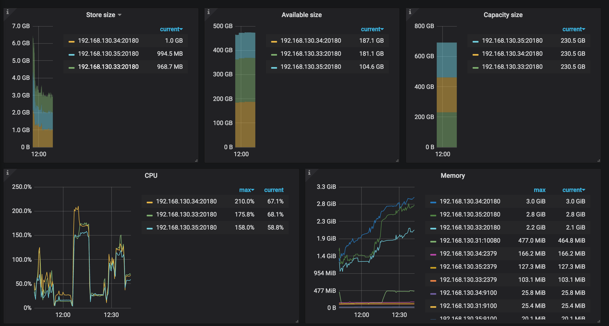
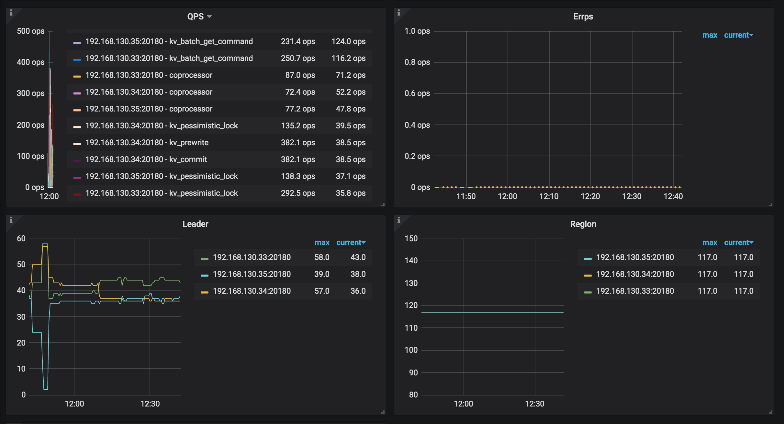

* TiKV Details 面板中 grpc 的 qps 以及 duration：
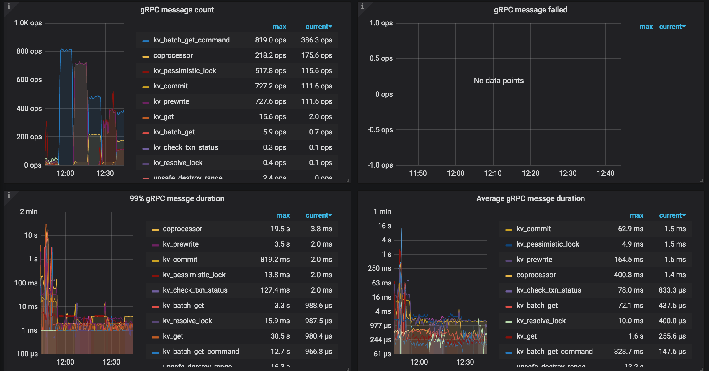

### go-ycsb 测试
#### 环境安装
```
git clone https://github.com/pingcap/go-ycsb.git
cd go-ycsb
make
```
#### 测试准备
* 导入数据：
```
> ./bin/go-ycsb load mysql -P workloads/workloada -p recordcount=1000000 -p mysql.host=192.168.130.31 -p mysql.port=4000 --threads 32
***************** properties *****************
"dotransactions"="false"
"readproportion"="0.5"
"insertproportion"="0"
"mysql.port"="4000"
"updateproportion"="0.5"
"scanproportion"="0"
"operationcount"="1000"
"readallfields"="true"
"mysql.host"="192.168.130.31"
"recordcount"="1000000"
"workload"="core"
"requestdistribution"="uniform"
"threadcount"="32"
**********************************************
INSERT - Takes(s): 9.9, Count: 7579, OPS: 764.2, Avg(us): 41568, Min(us): 37608, Max(us): 131229, 99th(us): 53000, 99.9th(us): 92000, 99.99th(us): 132000
INSERT - Takes(s): 19.9, Count: 15192, OPS: 762.6, Avg(us): 41785, Min(us): 37331, Max(us): 131229, 99th(us): 55000, 99.9th(us): 116000, 99.99th(us): 129000
INSERT - Takes(s): 29.9, Count: 22950, OPS: 767.0, Avg(us): 41564, Min(us): 37314, Max(us): 131229, 99th(us): 54000, 99.9th(us): 89000, 99.99th(us): 129000
...
INSERT - Takes(s): 1439.9, Count: 989505, OPS: 687.2, Avg(us): 46496, Min(us): 36947, Max(us): 915050, 99th(us): 64000, 99.9th(us): 140000, 99.99th(us): 297000
INSERT - Takes(s): 1449.9, Count: 996138, OPS: 687.0, Avg(us): 46508, Min(us): 36947, Max(us): 915050, 99th(us): 64000, 99.9th(us): 141000, 99.99th(us): 295000
INSERT - Takes(s): 1459.9, Count: 1000000, OPS: 685.0, Avg(us): 46511, Min(us): 36947, Max(us): 915050, 99th(us): 64000, 99.9th(us): 141000, 99.99th(us): 291000
Run finished, takes 24m26.317886672s
INSERT - Takes(s): 1466.2, Count: 1000000, OPS: 682.0, Avg(us): 46511, Min(us): 36947, Max(us): 915050, 99th(us): 64000, 99.9th(us): 141000, 99.99th(us): 291000
```
#### 场景测试
* wordloada 测试：
```
> ./bin/go-ycsb run mysql -P workloads/workloada -p operationcount=100000 -p mysql.host=192.168.130.31 -p mysql.port=4000 --threads 32
***************** properties *****************
"readproportion"="0.5"
"mysql.host"="192.168.130.31"
"mysql.port"="4000"
"updateproportion"="0.5"
"scanproportion"="0"
"dotransactions"="true"
"workload"="core"
"recordcount"="1000"
"threadcount"="32"
"readallfields"="true"
"requestdistribution"="uniform"
"operationcount"="100000"
"insertproportion"="0"
**********************************************
READ   - Takes(s): 9.8, Count: 3237, OPS: 330.1, Avg(us): 45159, Min(us): 38356, Max(us): 432494, 99th(us): 131000, 99.9th(us): 416000, 99.99th(us): 433000
UPDATE - Takes(s): 9.9, Count: 3187, OPS: 321.4, Avg(us): 53062, Min(us): 40253, Max(us): 423899, 99th(us): 134000, 99.9th(us): 416000, 99.99th(us): 424000
READ   - Takes(s): 19.8, Count: 6724, OPS: 339.5, Avg(us): 44644, Min(us): 38356, Max(us): 432494, 99th(us): 128000, 99.9th(us): 416000, 99.99th(us): 433000
UPDATE - Takes(s): 19.9, Count: 6563, OPS: 329.6, Avg(us): 51032, Min(us): 40253, Max(us): 434527, 99th(us): 134000, 99.9th(us): 424000, 99.99th(us): 435000
READ   - Takes(s): 29.8, Count: 10186, OPS: 341.7, Avg(us): 44443, Min(us): 38356, Max(us): 432494, 99th(us): 126000, 99.9th(us): 417000, 99.99th(us): 428000
UPDATE - Takes(s): 29.9, Count: 9999, OPS: 334.2, Avg(us): 50229, Min(us): 40253, Max(us): 434527, 99th(us): 131000, 99.9th(us): 424000, 99.99th(us): 435000
READ   - Takes(s): 39.8, Count: 13575, OPS: 341.0, Avg(us): 44620, Min(us): 38356, Max(us): 801252, 99th(us): 124000, 99.9th(us): 423000, 99.99th(us): 781000
UPDATE - Takes(s): 39.9, Count: 13339, OPS: 334.2, Avg(us): 50160, Min(us): 40253, Max(us): 434746, 99th(us): 132000, 99.9th(us): 426000, 99.99th(us): 435000
READ   - Takes(s): 49.8, Count: 17029, OPS: 341.9, Avg(us): 44678, Min(us): 38356, Max(us): 801252, 99th(us): 87000, 99.9th(us): 423000, 99.99th(us): 781000
UPDATE - Takes(s): 49.9, Count: 16683, OPS: 334.2, Avg(us): 49995, Min(us): 40253, Max(us): 434746, 99th(us): 132000, 99.9th(us): 426000, 99.99th(us): 435000
READ   - Takes(s): 59.8, Count: 20386, OPS: 340.9, Avg(us): 44775, Min(us): 38343, Max(us): 801252, 99th(us): 118000, 99.9th(us): 425000, 99.99th(us): 465000
UPDATE - Takes(s): 59.9, Count: 20032, OPS: 334.3, Avg(us): 50014, Min(us): 40253, Max(us): 798687, 99th(us): 132000, 99.9th(us): 427000, 99.99th(us): 438000
READ   - Takes(s): 69.8, Count: 23777, OPS: 340.6, Avg(us): 44702, Min(us): 38343, Max(us): 801252, 99th(us): 87000, 99.9th(us): 424000, 99.99th(us): 465000
UPDATE - Takes(s): 69.9, Count: 23468, OPS: 335.7, Avg(us): 49911, Min(us): 40253, Max(us): 798687, 99th(us): 131000, 99.9th(us): 427000, 99.99th(us): 438000
READ   - Takes(s): 79.8, Count: 27179, OPS: 340.6, Avg(us): 44612, Min(us): 38309, Max(us): 801252, 99th(us): 82000, 99.9th(us): 423000, 99.99th(us): 465000
UPDATE - Takes(s): 79.9, Count: 26904, OPS: 336.7, Avg(us): 49856, Min(us): 40253, Max(us): 798687, 99th(us): 131000, 99.9th(us): 426000, 99.99th(us): 454000
READ   - Takes(s): 89.8, Count: 30616, OPS: 340.9, Avg(us): 44709, Min(us): 38309, Max(us): 801252, 99th(us): 84000, 99.9th(us): 422000, 99.99th(us): 463000
UPDATE - Takes(s): 89.9, Count: 30179, OPS: 335.6, Avg(us): 49880, Min(us): 40253, Max(us): 798687, 99th(us): 131000, 99.9th(us): 426000, 99.99th(us): 438000
READ   - Takes(s): 99.8, Count: 34050, OPS: 341.2, Avg(us): 44699, Min(us): 38309, Max(us): 801252, 99th(us): 87000, 99.9th(us): 422000, 99.99th(us): 465000
UPDATE - Takes(s): 99.9, Count: 33469, OPS: 335.0, Avg(us): 49906, Min(us): 40253, Max(us): 798687, 99th(us): 132000, 99.9th(us): 426000, 99.99th(us): 438000
READ   - Takes(s): 109.8, Count: 37419, OPS: 340.8, Avg(us): 44688, Min(us): 38309, Max(us): 801252, 99th(us): 87000, 99.9th(us): 423000, 99.99th(us): 508000
UPDATE - Takes(s): 109.9, Count: 36914, OPS: 335.8, Avg(us): 49878, Min(us): 40253, Max(us): 798687, 99th(us): 133000, 99.9th(us): 427000, 99.99th(us): 458000
READ   - Takes(s): 119.8, Count: 40692, OPS: 339.6, Avg(us): 44821, Min(us): 37883, Max(us): 801252, 99th(us): 125000, 99.9th(us): 424000, 99.99th(us): 463000
UPDATE - Takes(s): 119.9, Count: 40204, OPS: 335.3, Avg(us): 49982, Min(us): 40253, Max(us): 798687, 99th(us): 134000, 99.9th(us): 427000, 99.99th(us): 454000
READ   - Takes(s): 129.8, Count: 44108, OPS: 339.8, Avg(us): 44755, Min(us): 37883, Max(us): 801252, 99th(us): 124000, 99.9th(us): 424000, 99.99th(us): 465000
UPDATE - Takes(s): 129.9, Count: 43664, OPS: 336.1, Avg(us): 49909, Min(us): 40253, Max(us): 798687, 99th(us): 133000, 99.9th(us): 427000, 99.99th(us): 454000
READ   - Takes(s): 139.8, Count: 47477, OPS: 339.6, Avg(us): 44758, Min(us): 37883, Max(us): 801252, 99th(us): 125000, 99.9th(us): 424000, 99.99th(us): 465000
UPDATE - Takes(s): 139.9, Count: 47025, OPS: 336.1, Avg(us): 49933, Min(us): 40253, Max(us): 798687, 99th(us): 134000, 99.9th(us): 427000, 99.99th(us): 454000
READ   - Takes(s): 149.8, Count: 50201, OPS: 335.1, Avg(us): 44738, Min(us): 37883, Max(us): 801252, 99th(us): 124000, 99.9th(us): 424000, 99.99th(us): 463000
UPDATE - Takes(s): 149.9, Count: 49794, OPS: 332.2, Avg(us): 49945, Min(us): 40253, Max(us): 798687, 99th(us): 133000, 99.9th(us): 427000, 99.99th(us): 454000
Run finished, takes 2m30.088945644s
READ   - Takes(s): 149.9, Count: 50204, OPS: 334.9, Avg(us): 44737, Min(us): 37883, Max(us): 801252, 99th(us): 124000, 99.9th(us): 424000, 99.99th(us): 463000
UPDATE - Takes(s): 150.0, Count: 49796, OPS: 332.0, Avg(us): 49944, Min(us): 40253, Max(us): 798687, 99th(us): 133000, 99.9th(us): 427000, 99.99th(us): 454000
```
* wordloadb 测试：
```
> ./bin/go-ycsb run mysql -P workloads/workloadb -p operationcount=100000 -p mysql.host=192.168.130.31 -p mysql.port=4000 --threads 32
***************** properties *****************
"requestdistribution"="uniform"
"scanproportion"="0"
"readallfields"="true"
"updateproportion"="0.05"
"insertproportion"="0"
"mysql.port"="4000"
"readproportion"="0.95"
"operationcount"="100000"
"mysql.host"="192.168.130.31"
"threadcount"="32"
"dotransactions"="true"
"recordcount"="1000"
"workload"="core"
**********************************************
READ   - Takes(s): 9.9, Count: 5768, OPS: 581.8, Avg(us): 49471, Min(us): 39014, Max(us): 428742, 99th(us): 151000, 99.9th(us): 422000, 99.99th(us): 429000
UPDATE - Takes(s): 9.6, Count: 337, OPS: 35.0, Avg(us): 78383, Min(us): 41513, Max(us): 426690, 99th(us): 175000, 99.9th(us): 427000, 99.99th(us): 427000
READ   - Takes(s): 19.9, Count: 11914, OPS: 598.3, Avg(us): 49402, Min(us): 39014, Max(us): 441664, 99th(us): 161000, 99.9th(us): 425000, 99.99th(us): 441000
UPDATE - Takes(s): 19.6, Count: 649, OPS: 33.0, Avg(us): 69737, Min(us): 41513, Max(us): 452172, 99th(us): 168000, 99.9th(us): 453000, 99.99th(us): 453000
READ   - Takes(s): 29.9, Count: 18041, OPS: 603.1, Avg(us): 49311, Min(us): 38897, Max(us): 441664, 99th(us): 166000, 99.9th(us): 426000, 99.99th(us): 442000
UPDATE - Takes(s): 29.6, Count: 960, OPS: 32.4, Avg(us): 66379, Min(us): 40149, Max(us): 452172, 99th(us): 178000, 99.9th(us): 453000, 99.99th(us): 453000
READ   - Takes(s): 39.9, Count: 24377, OPS: 610.7, Avg(us): 48932, Min(us): 38885, Max(us): 441664, 99th(us): 155000, 99.9th(us): 427000, 99.99th(us): 441000
UPDATE - Takes(s): 39.6, Count: 1262, OPS: 31.8, Avg(us): 63799, Min(us): 39788, Max(us): 452172, 99th(us): 185000, 99.9th(us): 427000, 99.99th(us): 453000
READ   - Takes(s): 49.9, Count: 30846, OPS: 618.0, Avg(us): 48377, Min(us): 38791, Max(us): 728074, 99th(us): 138000, 99.9th(us): 427000, 99.99th(us): 442000
UPDATE - Takes(s): 49.6, Count: 1642, OPS: 33.1, Avg(us): 61565, Min(us): 39788, Max(us): 452172, 99th(us): 178000, 99.9th(us): 434000, 99.99th(us): 453000
READ   - Takes(s): 59.9, Count: 37283, OPS: 622.3, Avg(us): 48173, Min(us): 38791, Max(us): 728074, 99th(us): 135000, 99.9th(us): 426000, 99.99th(us): 443000
UPDATE - Takes(s): 59.6, Count: 1958, OPS: 32.8, Avg(us): 59804, Min(us): 39788, Max(us): 452172, 99th(us): 168000, 99.9th(us): 434000, 99.99th(us): 453000
READ   - Takes(s): 69.9, Count: 43803, OPS: 626.5, Avg(us): 47941, Min(us): 38791, Max(us): 802280, 99th(us): 132000, 99.9th(us): 425000, 99.99th(us): 442000
UPDATE - Takes(s): 69.6, Count: 2266, OPS: 32.5, Avg(us): 58838, Min(us): 39788, Max(us): 452172, 99th(us): 165000, 99.9th(us): 428000, 99.99th(us): 453000
READ   - Takes(s): 79.9, Count: 50421, OPS: 631.0, Avg(us): 47619, Min(us): 38791, Max(us): 802280, 99th(us): 128000, 99.9th(us): 425000, 99.99th(us): 442000
UPDATE - Takes(s): 79.6, Count: 2614, OPS: 32.8, Avg(us): 57784, Min(us): 39763, Max(us): 452172, 99th(us): 147000, 99.9th(us): 428000, 99.99th(us): 453000
READ   - Takes(s): 89.9, Count: 56927, OPS: 633.1, Avg(us): 47504, Min(us): 38742, Max(us): 802280, 99th(us): 128000, 99.9th(us): 425000, 99.99th(us): 442000
UPDATE - Takes(s): 89.6, Count: 2961, OPS: 33.0, Avg(us): 56898, Min(us): 39763, Max(us): 452172, 99th(us): 143000, 99.9th(us): 428000, 99.99th(us): 453000
READ   - Takes(s): 99.9, Count: 63392, OPS: 634.5, Avg(us): 47404, Min(us): 38156, Max(us): 802280, 99th(us): 127000, 99.9th(us): 424000, 99.99th(us): 442000
UPDATE - Takes(s): 99.6, Count: 3307, OPS: 33.2, Avg(us): 56724, Min(us): 39019, Max(us): 452172, 99th(us): 147000, 99.9th(us): 427000, 99.99th(us): 453000
READ   - Takes(s): 109.9, Count: 69856, OPS: 635.6, Avg(us): 47372, Min(us): 38156, Max(us): 802280, 99th(us): 128000, 99.9th(us): 424000, 99.99th(us): 442000
UPDATE - Takes(s): 109.6, Count: 3617, OPS: 33.0, Avg(us): 56202, Min(us): 39019, Max(us): 452172, 99th(us): 143000, 99.9th(us): 427000, 99.99th(us): 453000
READ   - Takes(s): 119.9, Count: 76306, OPS: 636.3, Avg(us): 47343, Min(us): 38156, Max(us): 802280, 99th(us): 128000, 99.9th(us): 424000, 99.99th(us): 441000
UPDATE - Takes(s): 119.6, Count: 3940, OPS: 32.9, Avg(us): 55832, Min(us): 39019, Max(us): 452172, 99th(us): 142000, 99.9th(us): 429000, 99.99th(us): 453000
READ   - Takes(s): 129.9, Count: 82653, OPS: 636.2, Avg(us): 47375, Min(us): 38156, Max(us): 802280, 99th(us): 128000, 99.9th(us): 425000, 99.99th(us): 443000
UPDATE - Takes(s): 129.6, Count: 4253, OPS: 32.8, Avg(us): 55579, Min(us): 39019, Max(us): 452172, 99th(us): 142000, 99.9th(us): 428000, 99.99th(us): 453000
READ   - Takes(s): 139.9, Count: 88892, OPS: 635.3, Avg(us): 47426, Min(us): 38156, Max(us): 803705, 99th(us): 129000, 99.9th(us): 425000, 99.99th(us): 446000
UPDATE - Takes(s): 139.6, Count: 4607, OPS: 33.0, Avg(us): 55644, Min(us): 39019, Max(us): 452172, 99th(us): 145000, 99.9th(us): 429000, 99.99th(us): 453000
READ   - Takes(s): 149.9, Count: 94693, OPS: 631.7, Avg(us): 47446, Min(us): 38156, Max(us): 803705, 99th(us): 129000, 99.9th(us): 425000, 99.99th(us): 446000
UPDATE - Takes(s): 149.6, Count: 4939, OPS: 33.0, Avg(us): 55662, Min(us): 39019, Max(us): 452172, 99th(us): 152000, 99.9th(us): 434000, 99.99th(us): 453000
Run finished, takes 2m33.331732984s
READ   - Takes(s): 153.2, Count: 95042, OPS: 620.2, Avg(us): 47429, Min(us): 38156, Max(us): 803705, 99th(us): 128000, 99.9th(us): 425000, 99.99th(us): 446000
UPDATE - Takes(s): 153.0, Count: 4958, OPS: 32.4, Avg(us): 55646, Min(us): 39019, Max(us): 452172, 99th(us): 152000, 99.9th(us): 434000, 99.99th(us): 453000
```
* wordloadc 测试：
```
> ./bin/go-ycsb run mysql -P workloads/workloadc -p operationcount=100000 -p mysql.host=192.168.130.31 -p mysql.port=4000 --threads 32
***************** properties *****************
"requestdistribution"="uniform"
"insertproportion"="0"
"readproportion"="1"
"recordcount"="1000"
"readallfields"="true"
"mysql.host"="192.168.130.31"
"mysql.port"="4000"
"dotransactions"="true"
"threadcount"="32"
"scanproportion"="0"
"operationcount"="100000"
"updateproportion"="0"
"workload"="core"
**********************************************
READ   - Takes(s): 9.9, Count: 6483, OPS: 654.7, Avg(us): 48460, Min(us): 38948, Max(us): 721772, 99th(us): 135000, 99.9th(us): 451000, 99.99th(us): 722000
READ   - Takes(s): 19.9, Count: 13263, OPS: 666.4, Avg(us): 47866, Min(us): 38762, Max(us): 758553, 99th(us): 130000, 99.9th(us): 439000, 99.99th(us): 722000
READ   - Takes(s): 29.9, Count: 20021, OPS: 669.6, Avg(us): 47682, Min(us): 38687, Max(us): 758553, 99th(us): 130000, 99.9th(us): 427000, 99.99th(us): 481000
READ   - Takes(s): 39.9, Count: 26670, OPS: 668.4, Avg(us): 47785, Min(us): 38687, Max(us): 758553, 99th(us): 132000, 99.9th(us): 427000, 99.99th(us): 481000
READ   - Takes(s): 49.9, Count: 33165, OPS: 664.6, Avg(us): 48066, Min(us): 38420, Max(us): 758553, 99th(us): 135000, 99.9th(us): 424000, 99.99th(us): 481000
READ   - Takes(s): 59.9, Count: 39543, OPS: 660.1, Avg(us): 48379, Min(us): 38420, Max(us): 758553, 99th(us): 139000, 99.9th(us): 423000, 99.99th(us): 481000
READ   - Takes(s): 69.9, Count: 46448, OPS: 664.5, Avg(us): 48093, Min(us): 38420, Max(us): 758553, 99th(us): 136000, 99.9th(us): 421000, 99.99th(us): 475000
READ   - Takes(s): 79.9, Count: 53110, OPS: 664.7, Avg(us): 48064, Min(us): 38420, Max(us): 758553, 99th(us): 134000, 99.9th(us): 422000, 99.99th(us): 468000
READ   - Takes(s): 89.9, Count: 59978, OPS: 667.2, Avg(us): 47907, Min(us): 38420, Max(us): 758553, 99th(us): 132000, 99.9th(us): 422000, 99.99th(us): 468000
READ   - Takes(s): 99.9, Count: 66729, OPS: 668.0, Avg(us): 47856, Min(us): 38420, Max(us): 758553, 99th(us): 132000, 99.9th(us): 422000, 99.99th(us): 466000
READ   - Takes(s): 109.9, Count: 73532, OPS: 669.1, Avg(us): 47784, Min(us): 38420, Max(us): 758553, 99th(us): 132000, 99.9th(us): 422000, 99.99th(us): 460000
READ   - Takes(s): 119.9, Count: 80080, OPS: 667.9, Avg(us): 47866, Min(us): 38420, Max(us): 782591, 99th(us): 133000, 99.9th(us): 424000, 99.99th(us): 460000
READ   - Takes(s): 129.9, Count: 86543, OPS: 666.2, Avg(us): 47989, Min(us): 38420, Max(us): 782591, 99th(us): 134000, 99.9th(us): 423000, 99.99th(us): 460000
READ   - Takes(s): 139.9, Count: 93362, OPS: 667.4, Avg(us): 47915, Min(us): 38420, Max(us): 782591, 99th(us): 133000, 99.9th(us): 423000, 99.99th(us): 458000
READ   - Takes(s): 149.9, Count: 99505, OPS: 663.8, Avg(us): 47986, Min(us): 38420, Max(us): 782591, 99th(us): 133000, 99.9th(us): 423000, 99.99th(us): 458000
Run finished, takes 2m33.948136031s
READ   - Takes(s): 153.8, Count: 100000, OPS: 650.0, Avg(us): 47972, Min(us): 38420, Max(us): 782591, 99th(us): 133000, 99.9th(us): 423000, 99.99th(us): 458000
```
* wordloadd 测试：
```
> ./bin/go-ycsb run mysql -P workloads/workloadd -p operationcount=100000 -p mysql.host=192.168.130.31 -p mysql.port=4000 --threads 32
***************** properties *****************
"recordcount"="1000"
"readproportion"="0.95"
"requestdistribution"="latest"
"workload"="core"
"insertproportion"="0.05"
"scanproportion"="0"
"mysql.port"="4000"
"threadcount"="32"
"operationcount"="100000"
"updateproportion"="0"
"mysql.host"="192.168.130.31"
"readallfields"="true"
"dotransactions"="true"
**********************************************
INSERT - Takes(s): 9.7, Count: 331, OPS: 34.1, Avg(us): 50316, Min(us): 38315, Max(us): 466196, 99th(us): 129000, 99.9th(us): 467000, 99.99th(us): 467000
READ   - Takes(s): 9.9, Count: 6517, OPS: 657.0, Avg(us): 45794, Min(us): 38506, Max(us): 475055, 99th(us): 88000, 99.9th(us): 416000, 99.99th(us): 476000
INSERT - Takes(s): 19.7, Count: 639, OPS: 32.4, Avg(us): 48103, Min(us): 38315, Max(us): 466196, 99th(us): 125000, 99.9th(us): 467000, 99.99th(us): 467000
READ   - Takes(s): 19.9, Count: 12819, OPS: 643.6, Avg(us): 47121, Min(us): 38506, Max(us): 475055, 99th(us): 121000, 99.9th(us): 421000, 99.99th(us): 439000
INSERT - Takes(s): 29.7, Count: 988, OPS: 33.3, Avg(us): 46501, Min(us): 38315, Max(us): 466196, 99th(us): 125000, 99.9th(us): 467000, 99.99th(us): 467000
READ   - Takes(s): 29.9, Count: 19253, OPS: 643.6, Avg(us): 47216, Min(us): 38506, Max(us): 475055, 99th(us): 128000, 99.9th(us): 419000, 99.99th(us): 439000
INSERT - Takes(s): 39.7, Count: 1335, OPS: 33.6, Avg(us): 45713, Min(us): 38315, Max(us): 466196, 99th(us): 89000, 99.9th(us): 416000, 99.99th(us): 467000
READ   - Takes(s): 39.9, Count: 25730, OPS: 644.6, Avg(us): 47158, Min(us): 38480, Max(us): 475055, 99th(us): 125000, 99.9th(us): 419000, 99.99th(us): 439000
INSERT - Takes(s): 49.7, Count: 1679, OPS: 33.8, Avg(us): 45347, Min(us): 38315, Max(us): 466196, 99th(us): 89000, 99.9th(us): 416000, 99.99th(us): 467000
READ   - Takes(s): 49.9, Count: 32104, OPS: 643.2, Avg(us): 47289, Min(us): 38480, Max(us): 475055, 99th(us): 127000, 99.9th(us): 420000, 99.99th(us): 439000
INSERT - Takes(s): 59.7, Count: 2017, OPS: 33.8, Avg(us): 45727, Min(us): 38315, Max(us): 466196, 99th(us): 89000, 99.9th(us): 410000, 99.99th(us): 467000
READ   - Takes(s): 59.9, Count: 38094, OPS: 635.8, Avg(us): 47841, Min(us): 38480, Max(us): 764514, 99th(us): 130000, 99.9th(us): 425000, 99.99th(us): 760000
INSERT - Takes(s): 69.7, Count: 2349, OPS: 33.7, Avg(us): 46008, Min(us): 38315, Max(us): 466196, 99th(us): 125000, 99.9th(us): 416000, 99.99th(us): 467000
READ   - Takes(s): 69.9, Count: 44379, OPS: 634.7, Avg(us): 47869, Min(us): 38480, Max(us): 764514, 99th(us): 130000, 99.9th(us): 427000, 99.99th(us): 753000
INSERT - Takes(s): 79.7, Count: 2695, OPS: 33.8, Avg(us): 46052, Min(us): 38315, Max(us): 466196, 99th(us): 129000, 99.9th(us): 426000, 99.99th(us): 467000
READ   - Takes(s): 79.9, Count: 50573, OPS: 632.8, Avg(us): 48046, Min(us): 38480, Max(us): 784206, 99th(us): 131000, 99.9th(us): 428000, 99.99th(us): 753000
INSERT - Takes(s): 89.7, Count: 3051, OPS: 34.0, Avg(us): 45862, Min(us): 38315, Max(us): 466196, 99th(us): 128000, 99.9th(us): 416000, 99.99th(us): 467000
READ   - Takes(s): 89.9, Count: 57131, OPS: 635.4, Avg(us): 47853, Min(us): 38480, Max(us): 784206, 99th(us): 130000, 99.9th(us): 427000, 99.99th(us): 753000
INSERT - Takes(s): 99.7, Count: 3377, OPS: 33.9, Avg(us): 45864, Min(us): 38315, Max(us): 466196, 99th(us): 128000, 99.9th(us): 426000, 99.99th(us): 467000
READ   - Takes(s): 99.9, Count: 63529, OPS: 635.8, Avg(us): 47833, Min(us): 38480, Max(us): 784206, 99th(us): 129000, 99.9th(us): 427000, 99.99th(us): 748000
INSERT - Takes(s): 109.7, Count: 3716, OPS: 33.9, Avg(us): 45786, Min(us): 38315, Max(us): 466196, 99th(us): 127000, 99.9th(us): 426000, 99.99th(us): 467000
READ   - Takes(s): 109.9, Count: 69760, OPS: 634.7, Avg(us): 47931, Min(us): 38480, Max(us): 784206, 99th(us): 130000, 99.9th(us): 426000, 99.99th(us): 753000
INSERT - Takes(s): 119.7, Count: 4026, OPS: 33.6, Avg(us): 45998, Min(us): 38315, Max(us): 466196, 99th(us): 128000, 99.9th(us): 422000, 99.99th(us): 467000
READ   - Takes(s): 119.9, Count: 76163, OPS: 635.1, Avg(us): 47902, Min(us): 38480, Max(us): 784206, 99th(us): 130000, 99.9th(us): 426000, 99.99th(us): 753000
INSERT - Takes(s): 129.7, Count: 4352, OPS: 33.6, Avg(us): 46069, Min(us): 38315, Max(us): 466196, 99th(us): 129000, 99.9th(us): 426000, 99.99th(us): 467000
READ   - Takes(s): 129.9, Count: 82262, OPS: 633.2, Avg(us): 47998, Min(us): 38480, Max(us): 787594, 99th(us): 131000, 99.9th(us): 426000, 99.99th(us): 753000
INSERT - Takes(s): 139.7, Count: 4646, OPS: 33.3, Avg(us): 46556, Min(us): 38315, Max(us): 466196, 99th(us): 130000, 99.9th(us): 428000, 99.99th(us): 467000
READ   - Takes(s): 139.9, Count: 88125, OPS: 629.8, Avg(us): 48305, Min(us): 38462, Max(us): 792883, 99th(us): 135000, 99.9th(us): 427000, 99.99th(us): 760000
INSERT - Takes(s): 149.7, Count: 4965, OPS: 33.2, Avg(us): 46674, Min(us): 38315, Max(us): 466196, 99th(us): 131000, 99.9th(us): 428000, 99.99th(us): 467000
READ   - Takes(s): 149.9, Count: 94300, OPS: 629.0, Avg(us): 48236, Min(us): 38462, Max(us): 792883, 99th(us): 135000, 99.9th(us): 427000, 99.99th(us): 753000
Run finished, takes 2m35.09237374s
INSERT - Takes(s): 154.8, Count: 5003, OPS: 32.3, Avg(us): 46638, Min(us): 38315, Max(us): 466196, 99th(us): 130000, 99.9th(us): 427000, 99.99th(us): 467000
READ   - Takes(s): 155.0, Count: 94997, OPS: 612.9, Avg(us): 48239, Min(us): 38462, Max(us): 792883, 99th(us): 135000, 99.9th(us): 427000, 99.99th(us): 753000
```
* wordloade 测试：
```
> ./bin/go-ycsb run mysql -P workloads/workloade -p operationcount=100000 -p mysql.host=192.168.130.31 -p mysql.port=4000 --threads 32
***************** properties *****************
"scanproportion"="0.95"
"requestdistribution"="uniform"
"insertproportion"="0.05"
"scanlengthdistribution"="uniform"
"recordcount"="1000"
"readallfields"="true"
"mysql.host"="192.168.130.31"
"maxscanlength"="1"
"mysql.port"="4000"
"updateproportion"="0"
"workload"="core"
"threadcount"="32"
"readproportion"="0"
"operationcount"="100000"
"dotransactions"="true"
**********************************************
INSERT - Takes(s): 9.7, Count: 304, OPS: 31.4, Avg(us): 50084, Min(us): 38657, Max(us): 430622, 99th(us): 109000, 99.9th(us): 431000, 99.99th(us): 431000
SCAN   - Takes(s): 9.9, Count: 6015, OPS: 606.6, Avg(us): 49657, Min(us): 39868, Max(us): 814123, 99th(us): 136000, 99.9th(us): 435000, 99.99th(us): 815000
INSERT - Takes(s): 19.7, Count: 617, OPS: 31.3, Avg(us): 48181, Min(us): 38657, Max(us): 430622, 99th(us): 146000, 99.9th(us): 431000, 99.99th(us): 431000
SCAN   - Takes(s): 19.9, Count: 11929, OPS: 599.0, Avg(us): 50703, Min(us): 39678, Max(us): 814123, 99th(us): 173000, 99.9th(us): 439000, 99.99th(us): 809000
INSERT - Takes(s): 29.7, Count: 923, OPS: 31.1, Avg(us): 47541, Min(us): 38303, Max(us): 430622, 99th(us): 129000, 99.9th(us): 431000, 99.99th(us): 431000
SCAN   - Takes(s): 29.9, Count: 17980, OPS: 601.0, Avg(us): 50647, Min(us): 39612, Max(us): 814123, 99th(us): 155000, 99.9th(us): 446000, 99.99th(us): 809000
INSERT - Takes(s): 39.7, Count: 1244, OPS: 31.3, Avg(us): 47189, Min(us): 38303, Max(us): 430622, 99th(us): 129000, 99.9th(us): 416000, 99.99th(us): 431000
SCAN   - Takes(s): 39.9, Count: 24184, OPS: 605.9, Avg(us): 50269, Min(us): 39342, Max(us): 814123, 99th(us): 145000, 99.9th(us): 439000, 99.99th(us): 807000
INSERT - Takes(s): 49.7, Count: 1578, OPS: 31.8, Avg(us): 46894, Min(us): 38244, Max(us): 430622, 99th(us): 129000, 99.9th(us): 416000, 99.99th(us): 431000
SCAN   - Takes(s): 49.9, Count: 30651, OPS: 614.0, Avg(us): 49601, Min(us): 38323, Max(us): 814123, 99th(us): 139000, 99.9th(us): 438000, 99.99th(us): 788000
INSERT - Takes(s): 59.7, Count: 1903, OPS: 31.9, Avg(us): 47229, Min(us): 38244, Max(us): 430622, 99th(us): 138000, 99.9th(us): 416000, 99.99th(us): 431000
SCAN   - Takes(s): 59.9, Count: 36992, OPS: 617.4, Avg(us): 49296, Min(us): 38323, Max(us): 814123, 99th(us): 137000, 99.9th(us): 437000, 99.99th(us): 788000
INSERT - Takes(s): 69.7, Count: 2224, OPS: 31.9, Avg(us): 47253, Min(us): 38244, Max(us): 430622, 99th(us): 138000, 99.9th(us): 414000, 99.99th(us): 431000
SCAN   - Takes(s): 69.9, Count: 43149, OPS: 617.2, Avg(us): 49343, Min(us): 38323, Max(us): 814123, 99th(us): 138000, 99.9th(us): 433000, 99.99th(us): 784000
INSERT - Takes(s): 79.7, Count: 2572, OPS: 32.3, Avg(us): 47306, Min(us): 38244, Max(us): 430622, 99th(us): 141000, 99.9th(us): 416000, 99.99th(us): 431000
SCAN   - Takes(s): 79.9, Count: 49147, OPS: 615.0, Avg(us): 49486, Min(us): 38323, Max(us): 814123, 99th(us): 139000, 99.9th(us): 432000, 99.99th(us): 784000
INSERT - Takes(s): 89.7, Count: 2887, OPS: 32.2, Avg(us): 47188, Min(us): 38244, Max(us): 430622, 99th(us): 141000, 99.9th(us): 423000, 99.99th(us): 431000
SCAN   - Takes(s): 89.9, Count: 55214, OPS: 614.1, Avg(us): 49575, Min(us): 38323, Max(us): 814123, 99th(us): 141000, 99.9th(us): 435000, 99.99th(us): 779000
INSERT - Takes(s): 99.7, Count: 3203, OPS: 32.1, Avg(us): 47334, Min(us): 38244, Max(us): 435198, 99th(us): 141000, 99.9th(us): 423000, 99.99th(us): 436000
SCAN   - Takes(s): 99.9, Count: 61456, OPS: 615.1, Avg(us): 49474, Min(us): 38323, Max(us): 814123, 99th(us): 140000, 99.9th(us): 435000, 99.99th(us): 756000
INSERT - Takes(s): 109.7, Count: 3525, OPS: 32.1, Avg(us): 47166, Min(us): 38244, Max(us): 435198, 99th(us): 141000, 99.9th(us): 423000, 99.99th(us): 436000
SCAN   - Takes(s): 109.9, Count: 67674, OPS: 615.7, Avg(us): 49437, Min(us): 38323, Max(us): 814123, 99th(us): 140000, 99.9th(us): 434000, 99.99th(us): 756000
INSERT - Takes(s): 119.7, Count: 3826, OPS: 32.0, Avg(us): 47155, Min(us): 38244, Max(us): 435198, 99th(us): 139000, 99.9th(us): 423000, 99.99th(us): 431000
SCAN   - Takes(s): 119.9, Count: 73952, OPS: 616.7, Avg(us): 49393, Min(us): 38323, Max(us): 814123, 99th(us): 139000, 99.9th(us): 433000, 99.99th(us): 756000
INSERT - Takes(s): 129.7, Count: 4158, OPS: 32.1, Avg(us): 46915, Min(us): 38244, Max(us): 435198, 99th(us): 138000, 99.9th(us): 423000, 99.99th(us): 436000
SCAN   - Takes(s): 129.9, Count: 80290, OPS: 618.0, Avg(us): 49299, Min(us): 38323, Max(us): 814123, 99th(us): 139000, 99.9th(us): 432000, 99.99th(us): 751000
INSERT - Takes(s): 139.7, Count: 4495, OPS: 32.2, Avg(us): 46835, Min(us): 38244, Max(us): 435198, 99th(us): 138000, 99.9th(us): 423000, 99.99th(us): 436000
SCAN   - Takes(s): 139.9, Count: 86522, OPS: 618.4, Avg(us): 49262, Min(us): 38323, Max(us): 814123, 99th(us): 139000, 99.9th(us): 430000, 99.99th(us): 751000
INSERT - Takes(s): 149.7, Count: 4853, OPS: 32.4, Avg(us): 46679, Min(us): 38244, Max(us): 435198, 99th(us): 137000, 99.9th(us): 423000, 99.99th(us): 436000
SCAN   - Takes(s): 149.9, Count: 93045, OPS: 620.7, Avg(us): 49053, Min(us): 38323, Max(us): 814123, 99th(us): 137000, 99.9th(us): 428000, 99.99th(us): 751000
Run finished, takes 2m38.298364795s
INSERT - Takes(s): 158.0, Count: 4951, OPS: 31.3, Avg(us): 46703, Min(us): 38244, Max(us): 435198, 99th(us): 137000, 99.9th(us): 423000, 99.99th(us): 436000
SCAN   - Takes(s): 158.2, Count: 95049, OPS: 600.8, Avg(us): 49061, Min(us): 38323, Max(us): 814123, 99th(us): 137000, 99.9th(us): 428000, 99.99th(us): 751000
```
* wordloadf 测试：
```
> ./bin/go-ycsb run mysql -P workloads/workloadf -p operationcount=100000 -p mysql.host=192.168.130.31 -p mysql.port=4000 --threads 32
***************** properties *****************
"mysql.host"="192.168.130.31"
"threadcount"="32"
"readmodifywriteproportion"="0.5"
"updateproportion"="0"
"dotransactions"="true"
"mysql.port"="4000"
"readproportion"="0.5"
"recordcount"="1000"
"scanproportion"="0"
"insertproportion"="0"
"operationcount"="100000"
"readallfields"="true"
"requestdistribution"="uniform"
"workload"="core"
**********************************************
READ   - Takes(s): 9.9, Count: 4088, OPS: 412.6, Avg(us): 47520, Min(us): 38772, Max(us): 475456, 99th(us): 134000, 99.9th(us): 435000, 99.99th(us): 476000
READ_MODIFY_WRITE - Takes(s): 9.7, Count: 2031, OPS: 209.2, Avg(us): 105753, Min(us): 78748, Max(us): 597400, 99th(us): 267000, 99.9th(us): 513000, 99.99th(us): 598000
UPDATE - Takes(s): 9.7, Count: 2031, OPS: 209.2, Avg(us): 59344, Min(us): 38990, Max(us): 554827, 99th(us): 182000, 99.9th(us): 472000, 99.99th(us): 555000
READ   - Takes(s): 19.9, Count: 8481, OPS: 426.0, Avg(us): 46992, Min(us): 38363, Max(us): 475456, 99th(us): 132000, 99.9th(us): 433000, 99.99th(us): 476000
READ_MODIFY_WRITE - Takes(s): 19.7, Count: 4232, OPS: 214.7, Avg(us): 102390, Min(us): 78748, Max(us): 597400, 99th(us): 459000, 99.9th(us): 506000, 99.99th(us): 598000
UPDATE - Takes(s): 19.7, Count: 4232, OPS: 214.7, Avg(us): 55795, Min(us): 38990, Max(us): 554827, 99th(us): 182000, 99.9th(us): 462000, 99.99th(us): 555000
READ   - Takes(s): 29.9, Count: 12952, OPS: 433.1, Avg(us): 46571, Min(us): 38363, Max(us): 475456, 99th(us): 132000, 99.9th(us): 432000, 99.99th(us): 445000
READ_MODIFY_WRITE - Takes(s): 29.7, Count: 6517, OPS: 219.4, Avg(us): 100172, Min(us): 78748, Max(us): 597400, 99th(us): 284000, 99.9th(us): 505000, 99.99th(us): 598000
UPDATE - Takes(s): 29.7, Count: 6517, OPS: 219.4, Avg(us): 53802, Min(us): 38990, Max(us): 554827, 99th(us): 145000, 99.9th(us): 450000, 99.99th(us): 555000
READ   - Takes(s): 39.9, Count: 17561, OPS: 440.0, Avg(us): 46080, Min(us): 38363, Max(us): 475456, 99th(us): 130000, 99.9th(us): 430000, 99.99th(us): 445000
READ_MODIFY_WRITE - Takes(s): 39.7, Count: 8794, OPS: 221.4, Avg(us): 98779, Min(us): 78329, Max(us): 597400, 99th(us): 259000, 99.9th(us): 492000, 99.99th(us): 598000
UPDATE - Takes(s): 39.7, Count: 8794, OPS: 221.4, Avg(us): 52907, Min(us): 38990, Max(us): 554827, 99th(us): 139000, 99.9th(us): 440000, 99.99th(us): 555000
READ   - Takes(s): 49.9, Count: 22088, OPS: 442.6, Avg(us): 45722, Min(us): 38363, Max(us): 475456, 99th(us): 128000, 99.9th(us): 428000, 99.99th(us): 444000
READ_MODIFY_WRITE - Takes(s): 49.7, Count: 11147, OPS: 224.2, Avg(us): 97919, Min(us): 78329, Max(us): 645955, 99th(us): 230000, 99.9th(us): 492000, 99.99th(us): 598000
UPDATE - Takes(s): 49.7, Count: 11147, OPS: 224.2, Avg(us): 52397, Min(us): 38905, Max(us): 554827, 99th(us): 137000, 99.9th(us): 435000, 99.99th(us): 494000
READ   - Takes(s): 59.9, Count: 26634, OPS: 444.6, Avg(us): 45596, Min(us): 38363, Max(us): 475456, 99th(us): 128000, 99.9th(us): 427000, 99.99th(us): 444000
READ_MODIFY_WRITE - Takes(s): 59.7, Count: 13445, OPS: 225.2, Avg(us): 97610, Min(us): 78329, Max(us): 645955, 99th(us): 232000, 99.9th(us): 490000, 99.99th(us): 598000
UPDATE - Takes(s): 59.7, Count: 13445, OPS: 225.2, Avg(us): 52037, Min(us): 38779, Max(us): 554827, 99th(us): 136000, 99.9th(us): 435000, 99.99th(us): 494000
READ   - Takes(s): 69.9, Count: 31390, OPS: 449.0, Avg(us): 45227, Min(us): 38041, Max(us): 475456, 99th(us): 124000, 99.9th(us): 426000, 99.99th(us): 444000
READ_MODIFY_WRITE - Takes(s): 69.7, Count: 15810, OPS: 226.8, Avg(us): 96678, Min(us): 78329, Max(us): 645955, 99th(us): 216000, 99.9th(us): 487000, 99.99th(us): 598000
UPDATE - Takes(s): 69.7, Count: 15810, OPS: 226.8, Avg(us): 51490, Min(us): 38541, Max(us): 554827, 99th(us): 129000, 99.9th(us): 435000, 99.99th(us): 494000
READ   - Takes(s): 79.9, Count: 35875, OPS: 449.0, Avg(us): 45225, Min(us): 38041, Max(us): 741288, 99th(us): 125000, 99.9th(us): 425000, 99.99th(us): 444000
READ_MODIFY_WRITE - Takes(s): 79.7, Count: 18044, OPS: 226.4, Avg(us): 96783, Min(us): 78329, Max(us): 805426, 99th(us): 227000, 99.9th(us): 488000, 99.99th(us): 791000
UPDATE - Takes(s): 79.7, Count: 18044, OPS: 226.4, Avg(us): 51616, Min(us): 38541, Max(us): 761764, 99th(us): 133000, 99.9th(us): 435000, 99.99th(us): 747000
READ   - Takes(s): 89.9, Count: 40571, OPS: 451.3, Avg(us): 45021, Min(us): 38041, Max(us): 741288, 99th(us): 106000, 99.9th(us): 424000, 99.99th(us): 444000
READ_MODIFY_WRITE - Takes(s): 89.7, Count: 20410, OPS: 227.5, Avg(us): 96303, Min(us): 78329, Max(us): 805426, 99th(us): 215000, 99.9th(us): 486000, 99.99th(us): 787000
UPDATE - Takes(s): 89.7, Count: 20410, OPS: 227.5, Avg(us): 51313, Min(us): 38541, Max(us): 761764, 99th(us): 130000, 99.9th(us): 434000, 99.99th(us): 744000
READ   - Takes(s): 99.9, Count: 45234, OPS: 452.8, Avg(us): 44919, Min(us): 38041, Max(us): 741288, 99th(us): 91000, 99.9th(us): 422000, 99.99th(us): 444000
READ_MODIFY_WRITE - Takes(s): 99.7, Count: 22726, OPS: 227.9, Avg(us): 95955, Min(us): 78329, Max(us): 805426, 99th(us): 207000, 99.9th(us): 482000, 99.99th(us): 787000
UPDATE - Takes(s): 99.7, Count: 22726, OPS: 227.9, Avg(us): 51103, Min(us): 38541, Max(us): 761764, 99th(us): 128000, 99.9th(us): 434000, 99.99th(us): 744000
READ   - Takes(s): 109.9, Count: 49924, OPS: 454.2, Avg(us): 44885, Min(us): 38041, Max(us): 741288, 99th(us): 90000, 99.9th(us): 422000, 99.99th(us): 444000
READ_MODIFY_WRITE - Takes(s): 109.7, Count: 24962, OPS: 227.5, Avg(us): 95787, Min(us): 78283, Max(us): 805426, 99th(us): 204000, 99.9th(us): 482000, 99.99th(us): 787000
UPDATE - Takes(s): 109.7, Count: 24962, OPS: 227.5, Avg(us): 50982, Min(us): 38541, Max(us): 761764, 99th(us): 127000, 99.9th(us): 433000, 99.99th(us): 744000
READ   - Takes(s): 119.9, Count: 54490, OPS: 454.4, Avg(us): 44848, Min(us): 38041, Max(us): 741288, 99th(us): 88000, 99.9th(us): 421000, 99.99th(us): 444000
READ_MODIFY_WRITE - Takes(s): 119.7, Count: 27250, OPS: 227.6, Avg(us): 95762, Min(us): 78283, Max(us): 805426, 99th(us): 205000, 99.9th(us): 481000, 99.99th(us): 787000
UPDATE - Takes(s): 119.7, Count: 27250, OPS: 227.6, Avg(us): 50984, Min(us): 38541, Max(us): 761764, 99th(us): 130000, 99.9th(us): 432000, 99.99th(us): 744000
READ   - Takes(s): 129.9, Count: 59058, OPS: 454.6, Avg(us): 44823, Min(us): 38041, Max(us): 741288, 99th(us): 93000, 99.9th(us): 421000, 99.99th(us): 444000
READ_MODIFY_WRITE - Takes(s): 129.7, Count: 29506, OPS: 227.5, Avg(us): 95784, Min(us): 78283, Max(us): 805426, 99th(us): 210000, 99.9th(us): 480000, 99.99th(us): 787000
UPDATE - Takes(s): 129.7, Count: 29506, OPS: 227.5, Avg(us): 51036, Min(us): 38541, Max(us): 761764, 99th(us): 132000, 99.9th(us): 431000, 99.99th(us): 744000
READ   - Takes(s): 139.9, Count: 63594, OPS: 454.5, Avg(us): 44924, Min(us): 38041, Max(us): 741288, 99th(us): 122000, 99.9th(us): 421000, 99.99th(us): 444000
READ_MODIFY_WRITE - Takes(s): 139.7, Count: 31677, OPS: 226.7, Avg(us): 95867, Min(us): 78283, Max(us): 805426, 99th(us): 212000, 99.9th(us): 481000, 99.99th(us): 646000
UPDATE - Takes(s): 139.7, Count: 31677, OPS: 226.7, Avg(us): 51009, Min(us): 38541, Max(us): 761764, 99th(us): 132000, 99.9th(us): 431000, 99.99th(us): 555000
READ   - Takes(s): 149.9, Count: 68133, OPS: 454.5, Avg(us): 44942, Min(us): 38041, Max(us): 741288, 99th(us): 122000, 99.9th(us): 422000, 99.99th(us): 444000
READ_MODIFY_WRITE - Takes(s): 149.7, Count: 33967, OPS: 226.9, Avg(us): 95829, Min(us): 78283, Max(us): 805426, 99th(us): 208000, 99.9th(us): 481000, 99.99th(us): 646000
UPDATE - Takes(s): 149.7, Count: 33967, OPS: 226.9, Avg(us): 50939, Min(us): 38541, Max(us): 761764, 99th(us): 131000, 99.9th(us): 431000, 99.99th(us): 555000
READ   - Takes(s): 159.9, Count: 72653, OPS: 454.3, Avg(us): 45011, Min(us): 38041, Max(us): 741288, 99th(us): 122000, 99.9th(us): 423000, 99.99th(us): 445000
READ_MODIFY_WRITE - Takes(s): 159.7, Count: 36210, OPS: 226.7, Avg(us): 95806, Min(us): 78283, Max(us): 805426, 99th(us): 205000, 99.9th(us): 481000, 99.99th(us): 646000
UPDATE - Takes(s): 159.7, Count: 36210, OPS: 226.7, Avg(us): 50885, Min(us): 38541, Max(us): 761764, 99th(us): 130000, 99.9th(us): 431000, 99.99th(us): 555000
READ   - Takes(s): 169.9, Count: 77321, OPS: 455.1, Avg(us): 44967, Min(us): 38041, Max(us): 741288, 99th(us): 118000, 99.9th(us): 422000, 99.99th(us): 445000
READ_MODIFY_WRITE - Takes(s): 169.7, Count: 38516, OPS: 227.0, Avg(us): 95680, Min(us): 78283, Max(us): 805426, 99th(us): 201000, 99.9th(us): 480000, 99.99th(us): 646000
UPDATE - Takes(s): 169.7, Count: 38516, OPS: 227.0, Avg(us): 50775, Min(us): 38541, Max(us): 761764, 99th(us): 127000, 99.9th(us): 430000, 99.99th(us): 555000
READ   - Takes(s): 179.9, Count: 81956, OPS: 455.6, Avg(us): 44954, Min(us): 38041, Max(us): 741288, 99th(us): 122000, 99.9th(us): 421000, 99.99th(us): 444000
READ_MODIFY_WRITE - Takes(s): 179.7, Count: 40760, OPS: 226.8, Avg(us): 95637, Min(us): 78283, Max(us): 805426, 99th(us): 202000, 99.9th(us): 479000, 99.99th(us): 598000
UPDATE - Takes(s): 179.7, Count: 40760, OPS: 226.8, Avg(us): 50733, Min(us): 38541, Max(us): 761764, 99th(us): 127000, 99.9th(us): 430000, 99.99th(us): 494000
READ   - Takes(s): 189.9, Count: 86591, OPS: 456.0, Avg(us): 44914, Min(us): 38041, Max(us): 741288, 99th(us): 94000, 99.9th(us): 421000, 99.99th(us): 444000
READ_MODIFY_WRITE - Takes(s): 189.7, Count: 43088, OPS: 227.1, Avg(us): 95550, Min(us): 78283, Max(us): 805426, 99th(us): 199000, 99.9th(us): 479000, 99.99th(us): 598000
UPDATE - Takes(s): 189.7, Count: 43088, OPS: 227.1, Avg(us): 50663, Min(us): 38541, Max(us): 761764, 99th(us): 126000, 99.9th(us): 429000, 99.99th(us): 494000
READ   - Takes(s): 199.9, Count: 91098, OPS: 455.7, Avg(us): 44942, Min(us): 38041, Max(us): 741288, 99th(us): 121000, 99.9th(us): 421000, 99.99th(us): 444000
READ_MODIFY_WRITE - Takes(s): 199.7, Count: 45337, OPS: 227.0, Avg(us): 95552, Min(us): 78283, Max(us): 818122, 99th(us): 202000, 99.9th(us): 480000, 99.99th(us): 646000
UPDATE - Takes(s): 199.7, Count: 45337, OPS: 227.0, Avg(us): 50662, Min(us): 38541, Max(us): 772201, 99th(us): 125000, 99.9th(us): 430000, 99.99th(us): 555000
READ   - Takes(s): 209.9, Count: 95712, OPS: 456.0, Avg(us): 44937, Min(us): 38041, Max(us): 741288, 99th(us): 122000, 99.9th(us): 421000, 99.99th(us): 439000
READ_MODIFY_WRITE - Takes(s): 209.7, Count: 47643, OPS: 227.2, Avg(us): 95476, Min(us): 78283, Max(us): 818122, 99th(us): 201000, 99.9th(us): 479000, 99.99th(us): 646000
UPDATE - Takes(s): 209.7, Count: 47643, OPS: 227.2, Avg(us): 50598, Min(us): 38541, Max(us): 772201, 99th(us): 124000, 99.9th(us): 429000, 99.99th(us): 555000
READ   - Takes(s): 219.9, Count: 99809, OPS: 453.9, Avg(us): 44947, Min(us): 38041, Max(us): 741288, 99th(us): 123000, 99.9th(us): 421000, 99.99th(us): 444000
READ_MODIFY_WRITE - Takes(s): 219.7, Count: 49612, OPS: 225.8, Avg(us): 95484, Min(us): 78283, Max(us): 818122, 99th(us): 202000, 99.9th(us): 479000, 99.99th(us): 646000
UPDATE - Takes(s): 219.7, Count: 49612, OPS: 225.8, Avg(us): 50632, Min(us): 38541, Max(us): 772201, 99th(us): 127000, 99.9th(us): 429000, 99.99th(us): 555000
Run finished, takes 3m43.165285944s
READ   - Takes(s): 223.1, Count: 100000, OPS: 448.3, Avg(us): 44944, Min(us): 38041, Max(us): 741288, 99th(us): 123000, 99.9th(us): 421000, 99.99th(us): 439000
READ_MODIFY_WRITE - Takes(s): 222.9, Count: 49706, OPS: 223.0, Avg(us): 95475, Min(us): 78283, Max(us): 818122, 99th(us): 202000, 99.9th(us): 479000, 99.99th(us): 646000
UPDATE - Takes(s): 222.9, Count: 49706, OPS: 223.0, Avg(us): 50629, Min(us): 38541, Max(us): 772201, 99th(us): 127000, 99.9th(us): 429000, 99.99th(us): 555000
```

#### 监控截图
* TiDB Query Summary 中的 qps 与 duration：
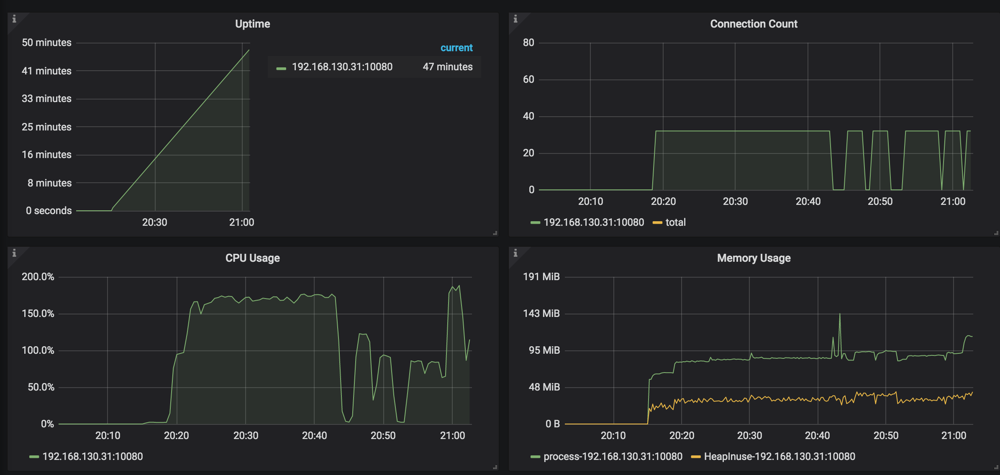
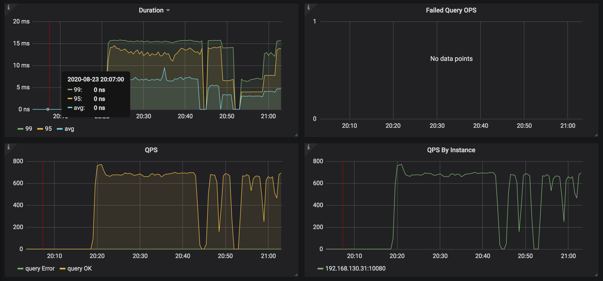

* TiKV Details 面板中 Cluster 中各 server 的 CPU 以及 QPS 指标：
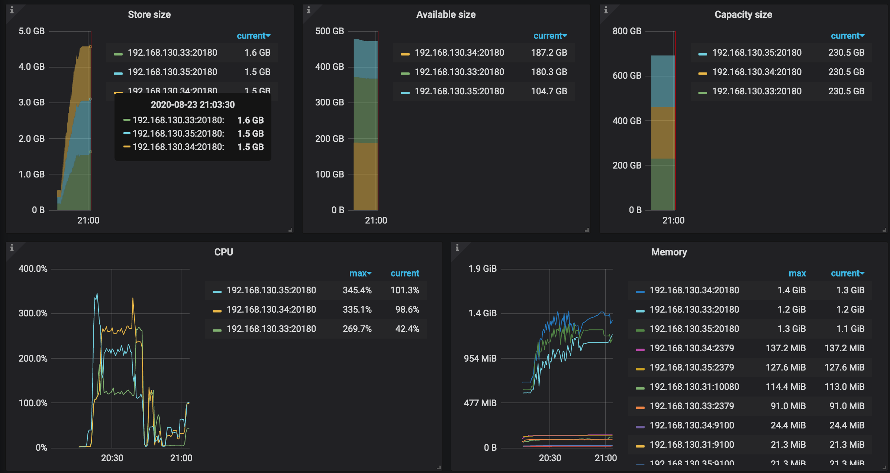
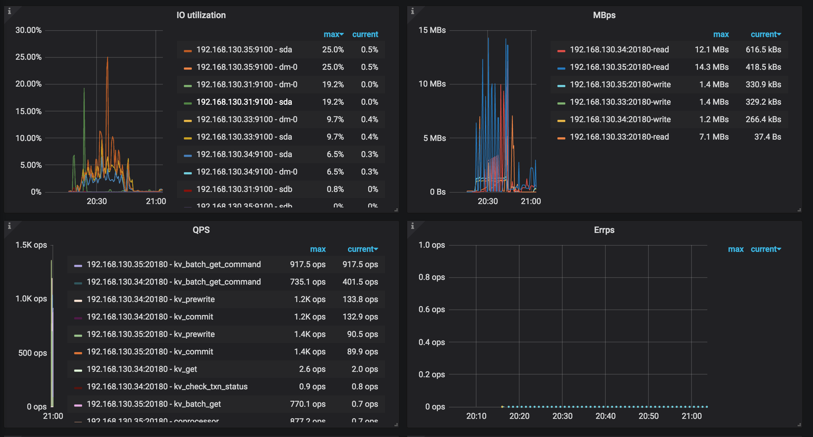

* TiKV Details 面板中 grpc 的 qps 以及 duration：
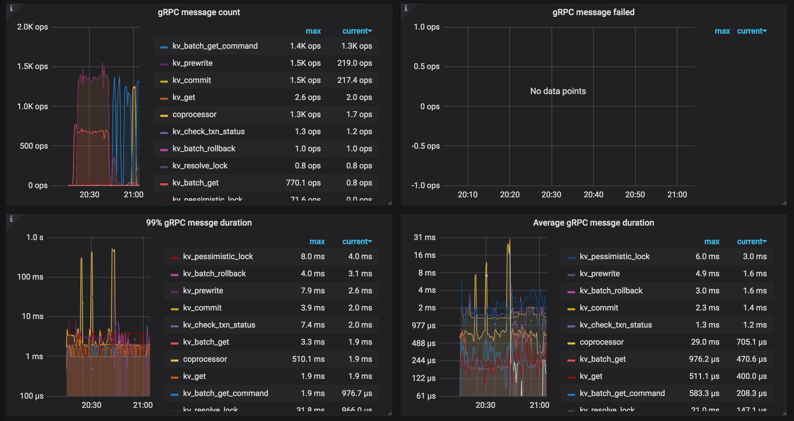

### go-tpc 测试

#### 环境安装
```
git clone https://github.com/pingcap/go-tpc.git
cd go-tpc
make build
```

#### TPCC 性能测试
* 测试准备：
```
> ./bin/go-tpc tpcc -H 192.168.130.31 -P 4000 -D tpcc --warehouses 6 prepare -T 3
```
* 场景测试：
```
> ./bin/go-tpc tpcc -H 192.168.130.31 -P 4000 -D tpcc --warehouses 6 run --threads 3 --time 3m
...
Finished
[Summary] DELIVERY - Takes(s): 170.3, Count: 38, TPM: 13.4, Sum(ms): 46685, Avg(ms): 1228, 90th(ms): 1500, 99th(ms): 4000, 99.9th(ms): 4000
[Summary] NEW_ORDER - Takes(s): 176.4, Count: 393, TPM: 133.7, Sum(ms): 314956, Avg(ms): 801, 90th(ms): 1000, 99th(ms): 1500, 99.9th(ms): 2000
[Summary] NEW_ORDER_ERR - Takes(s): 176.4, Count: 3, TPM: 1.0, Sum(ms): 1164, Avg(ms): 388, 90th(ms): 1000, 99th(ms): 1000, 99.9th(ms): 1000
[Summary] ORDER_STATUS - Takes(s): 177.3, Count: 30, TPM: 10.2, Sum(ms): 6801, Avg(ms): 226, 90th(ms): 256, 99th(ms): 256, 99.9th(ms): 256
[Summary] PAYMENT - Takes(s): 177.0, Count: 380, TPM: 128.8, Sum(ms): 155125, Avg(ms): 408, 90th(ms): 512, 99th(ms): 1000, 99.9th(ms): 1000
[Summary] STOCK_LEVEL - Takes(s): 163.3, Count: 41, TPM: 15.1, Sum(ms): 7196, Avg(ms): 175, 90th(ms): 192, 99th(ms): 512, 99.9th(ms): 512
tpmC: 133.7
```

#### TPCH 性能测试
* 测试准备：

OLAP 场景导入数据太慢了... sf 为 4 的时候导入导了两个小时都没导进去，最后改为 1 都导了一个多小时。
```
./bin/go-tpc tpch prepare -H 192.168.130.31 -P 4000 -D tpch --sf 1 --analyze
```
* 场景测试：
```
./bin/go-tpc tpch run -H 192.168.130.31 -P 4000 -D tpch --sf 1
...
Finished
[Summary] Q1: 1.07s
[Summary] Q10: 1.01s
[Summary] Q11: 1.22s
[Summary] Q12: 0.62s
[Summary] Q13: 1.49s
[Summary] Q14: 0.62s
[Summary] Q15: 1.09s
[Summary] Q16: 0.47s
[Summary] Q17: 6.08s
[Summary] Q18: 5.14s
[Summary] Q19: 0.71s
[Summary] Q2: 1.07s
[Summary] Q20: 0.76s
[Summary] Q21: 2.10s
[Summary] Q22: 0.64s
[Summary] Q3: 1.08s
[Summary] Q4: 0.69s
[Summary] Q5: 5.31s
[Summary] Q6: 0.45s
[Summary] Q7: 2.02s
[Summary] Q8: 1.09s
[Summary] Q9: 8.29s
```

#### 监控截图
* TiDB Query Summary 中的 qps 与 duration：
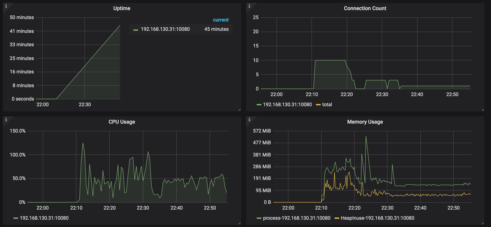
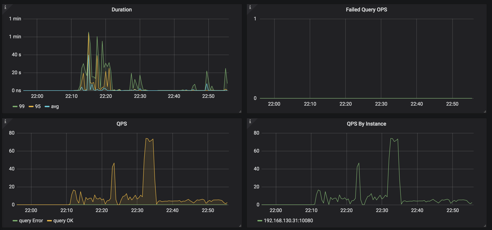

* TiKV Details 面板中 Cluster 中各 server 的 CPU 以及 QPS 指标：
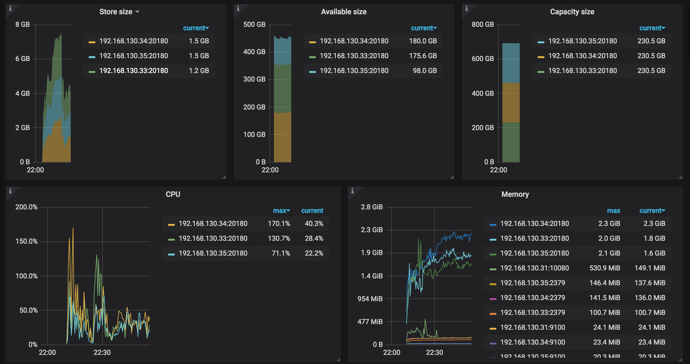
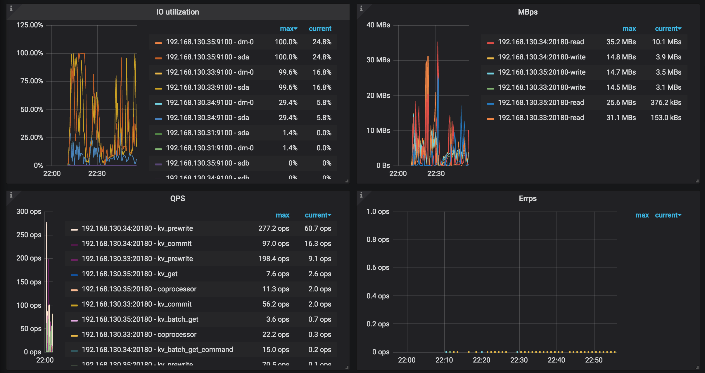

* TiKV Details 面板中 grpc 的 qps 以及 duration：
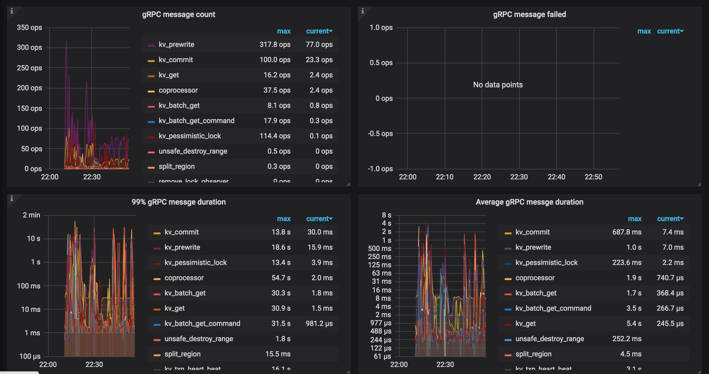

### 实验分析

* sysbench：

根据计算公式 `QPS = 活跃连接数 * (1000ms/平均 duration)` 推断出理论 QPS 应该有 4000 左右，可是实际 QPS 只有 800 左右，有 5 倍左右的差距。 查看监控之后发现似乎都没达到瓶颈，没太想明白是哪里有瓶颈。

* go-ycsb：

同上，不过此负载可以看出 TiKV 的 CPU 不均衡，可能存在热点问题。

* go-tpc：

这里数据量都比较大，TiKV 的磁盘使用率达到了 100%。由于部署机器的磁盘是 HDD， 而 TiKV 的建议部署环境磁盘是 SSD。因此磁盘成为了此测试尤其是 OLAP 场景下的瓶颈。 

## 实验资料
[【High Performance TiDB】Lesson 02：对 TiDB 进行基准测试](https://www.bilibili.com/video/BV1TD4y1m7AF)

[使用 TiUP 部署运维 TiDB 线上集群](https://docs.pingcap.com/zh/tidb/stable/tiup-cluster)

[TiDB 环境与系统配置检查](https://docs.pingcap.com/zh/tidb/stable/check-before-deployment)

[TiUP 配置参数模版](https://github.com/pingcap/tiup/blob/master/examples/topology.example.yaml)

[TIDB 优化--TiKV 性能参数调优](https://blog.csdn.net/weixin_36135773/article/details/79767379)

[TiDB 性能问题排查常用操作](https://asktug.com/t/topic/113)