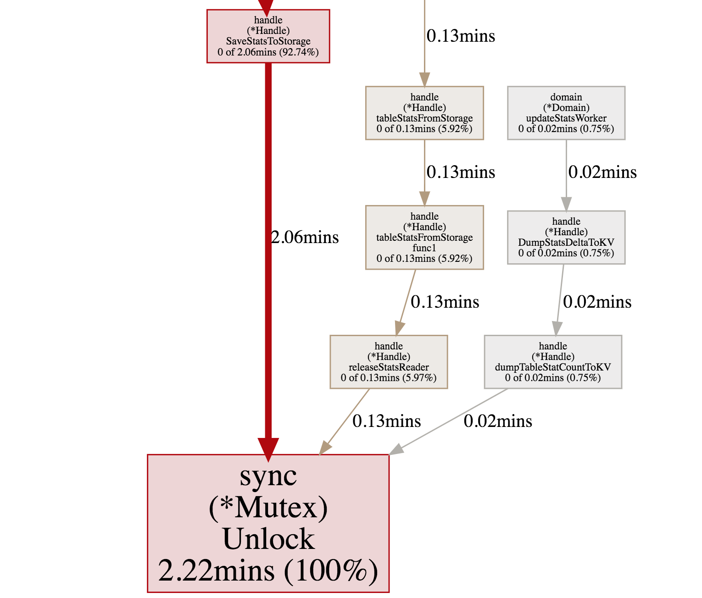

<!-- TOC -->

- [实验要求](#实验要求)
- [实验环境](#实验环境)
- [实验过程](#实验过程)
    - [TiUP 部署](#tiup-部署)
    - [workload 情况](#workload-情况)
        - [sysbench 数据准备](#sysbench-数据准备)
        - [sysbench 压测](#sysbench-压测)
    - [对应的 profile 看到的情况](#对应的-profile-看到的情况)
    - [建议如何优化](#建议如何优化)
    - [issue](#issue)
- [实验资料](#实验资料)

<!-- /TOC -->
## 实验要求
使用上一节可以讲的 sysbench、go-ycsb 或者 go-tpc 对 TiDB 进行压力测试， 然后对 TiDB 或 TiKV 的 CPU 、内存或 IO 进行 profile，寻找潜在可以优化的地 方并提 enhance 类型的 issue 描述。
issue 描述应包含:
* 部署环境的机器配置(CPU、内存、磁盘规格型号)，拓扑结构(TiDB、TiKV 各部署于哪些节点)
* 跑的 workload 情况
* 对应的 profile 看到的情况
* 建议如何优化?

【可选】提 PR 进行优化:
*  按照 PR 模板提交优化 PR

输出：对 TiDB 或 TiKV 进行 profile，写文章描述分析的过程，对于可以优化的地方提 issue 描述 ，并将 issue 贴到文章中(或【可选】提 PR 进行优 化，将 PR 贴到文章中)

## 实验环境
| 组件 | IP 地址 | 操作系统 | CPU | 内存 | 磁盘规格型号 | 网卡 | 
|  ----  | ----  |  ----  | ----  |  ----  | ----  |  ----  |
| TiDB | 192.168.130.31  |  CentOS 7.7  | 12  Intel(R) Core(TM) i7-8700 CPU @ 3.20GHz  |  16G  | HDD  | 千兆网卡 | 
| TiKV1 | 192.168.130.33  |  CentOS 7.8  | 12  Intel(R) Core(TM) i7-8700 CPU @ 3.20GHz  |  16G  | HDD  | 千兆网卡 | 
| TiKV2 | 192.168.130.34  |  CentOS 7.7  | 12  Intel(R) Core(TM) i7-8700 CPU @ 3.20GHz  |  16G  | HDD  | 千兆网卡 | 
| TiKV3 | 192.168.130.35  |  CentOS 7.5  | 12  Intel(R) Core(TM) i7-8700 CPU @ 3.20GHz  |  16G  | HDD  | 千兆网卡 | 
| PD1 | 192.168.130.33  |  CentOS 7.8  | 12  Intel(R) Core(TM) i7-8700 CPU @ 3.20GHz  |  16G  | HDD  | 千兆网卡 | 
| PD2 | 192.168.130.34  |  CentOS 7.7  | 12  Intel(R) Core(TM) i7-8700 CPU @ 3.20GHz  |  16G  | HDD  | 千兆网卡 | 
| PD3 | 192.168.130.35  |  CentOS 7.5  | 12  Intel(R) Core(TM) i7-8700 CPU @ 3.20GHz  |  16G  | HDD  | 千兆网卡 |

## 实验过程
### TiUP 部署
* 如上周作业一样，使用 TiUP Cluster 部署即可，由于是为了检测性能瓶颈，因此要使用最新的版本而不是指定的版本。即使用 `nightly` 版本：
```
tiup cluster deploy tidb-test nightly ./topology.yaml --user liurui
```
* 拓扑结构如下所示：
```
# # Global variables are applied to all deployments and used as the default value of
# # the deployments if a specific deployment value is missing.
global:
  user: "liurui"
  ssh_port: 22
  deploy_dir: "txy_test/deploy"
  data_dir: "txy_test/data"

server_configs:
  tidb:
    binlog.enable: false
    binlog.ignore-error: false
  tikv:
    # 通常情况下使用默认值就可以了。在导数据的情况下建议将该参数设置为 1024000
    storage.scheduler-concurrency: 1024000
    # 该参数控制写入线程的个数，当写入操作比较频繁的时候，需要把该参数调大。使用 top -H -p tikv-pid
    # 发现名称为 sched-worker-pool 的线程都特别忙，这个时候就需要将 scheduler-worker-pool-size
    # 参数调大，增加写线程的个数。
    storage.scheduler-worker-pool-size: 8
    # 默认为 true，表示强制将数据刷到磁盘上。如果是非金融安全级别的业务场景，建议设置成 false，
    # 以便获得更高的性能。
    raftstore.sync-log: false
    # 开启 RocksDB compaction 过程中的预读功能，如果使用的是机械磁盘，建议该值至少为2MB。
    rocksdb.compaction-readahead-size: "2MB"
    # 最多允许几个 memtable 存在。写入到 RocksDB 的数据首先会记录到 WAL 日志里面，然后会插入到
    # memtable 里面，当 memtable 的大小到达了 write-buffer-size 限定的大小的时候，当前的
    # memtable 会变成只读的，然后生成一个新的 memtable 接收新的写入。只读的 memtable 会被
    # RocksDB 的 flush 线程（max-background-flushes 参数能够控制 flush 线程的最大个数）
    # flush 到磁盘，成为 level0 的一个 sst 文件。当 flush 线程忙不过来，导致等待 flush 到磁盘的
    # memtable 的数量到达 max-write-buffer-number 限定的个数的时候，RocksDB 会将新的写入
    # stall 住，stall 是 RocksDB 的一种流控机制。在导数据的时候可以将 max-write-buffer-number
    # 的值设置的更大一点，例如 10。
    rocksdb.defaultcf.max-write-buffer-number: 10
    # 当 level0 的 sst 文件个数到达 level0-slowdown-writes-trigger 指定的限度的时候，
    # RocksDB 会尝试减慢写入的速度。因为 level0 的 sst 太多会导致 RocksDB 的读放大上升。
    # level0-slowdown-writes-trigger 和 level0-stop-writes-trigger 是 RocksDB 进行流控的
    # 另一个表现。当 level0 的 sst 的文件个数到达 4（默认值），level0 的 sst 文件会和 level1 中
    # 有 overlap 的 sst 文件进行 compaction，缓解读放大的问题。
    rocksdb.defaultcf.level0-slowdown-writes-trigger: 20
    readpool.storage.use-unified-pool: false
    readpool.coprocessor.use-unified-pool: true
  pd:
    schedule.leader-schedule-limit: 4
    schedule.region-schedule-limit: 2048
    schedule.replica-schedule-limit: 64
  

pd_servers:
  - host: 192.168.130.33
  - host: 192.168.130.34
  - host: 192.168.130.35

tidb_servers:
  - host: 192.168.130.31

tikv_servers:
  - host: 192.168.130.33
  - host: 192.168.130.34
  - host: 192.168.130.35

monitoring_servers:
  - host: 192.168.130.31

grafana_servers:
  - host: 192.168.130.31

alertmanager_servers:
  - host: 192.168.130.31
```
### workload 情况

#### sysbench 数据准备
* 提前在 TiDB 建立好 sysbench 的 database，然后开始 prepare 数据：
```
sysbench oltp_write_only --config-file=config  --tables=32 --table-size=30000 prepare
```
* config 文件如下：
```
mysql-host=192.168.130.31
mysql-port=4000
mysql-user=root
mysql-db=sysbench
time=600
threads=32
report-interval=10
db-driver=mysql
```

#### sysbench 压测
* 选择 sysbench 的 write_only 负载进行压测：
```
sysbench oltp_write_only --config-file=config  --tables=32 --table-size=30000 run
```

### 对应的 profile 看到的情况
在压测过程中对 TiDB 进行 profile 后利用 `http://192.168.130.31:10080/debug/zip` 来下载 profile 信息，然后进入此目录运行 `go tool pprof -http=:8080 mutex` 来查看锁的 profile 情况，如下图所示：


### 建议如何优化

可以看到在 sysbench 的 write_only 负载下，服务端 statistics 目录下 handler 包中的 SaveStatsToStorage 函数等待锁的时间耗费较多，达到了两分钟。

由于我对 TiDB 代码的了解还不够，所以目前只能从宏观上猜测一下可能的优化方向：即是否能够考虑对此处的锁粒度进行优化：比如减少锁的作用快，将一些不会产生冲突的耗时操作（比如 RPC 操作）提前分离出来再对必须访问共享内存的代码块上锁等等，这样可能能够一定程度上提升性能。

### issue
[Performance enhance about statistics's lock](https://github.com/pingcap/tidb/issues/19599)

## 实验资料
[【High Performance TiDB】Lesson 03：通过工具寻找 TiDB 瓶颈](https://www.bilibili.com/video/BV1Pp4y1i7zu)

[TiDB Dashboard 实例性能分析页面](https://docs.pingcap.com/zh/tidb/stable/dashboard-profiling#tidb-dashboard-%E5%AE%9E%E4%BE%8B%E6%80%A7%E8%83%BD%E5%88%86%E6%9E%90%E9%A1%B5%E9%9D%A2)